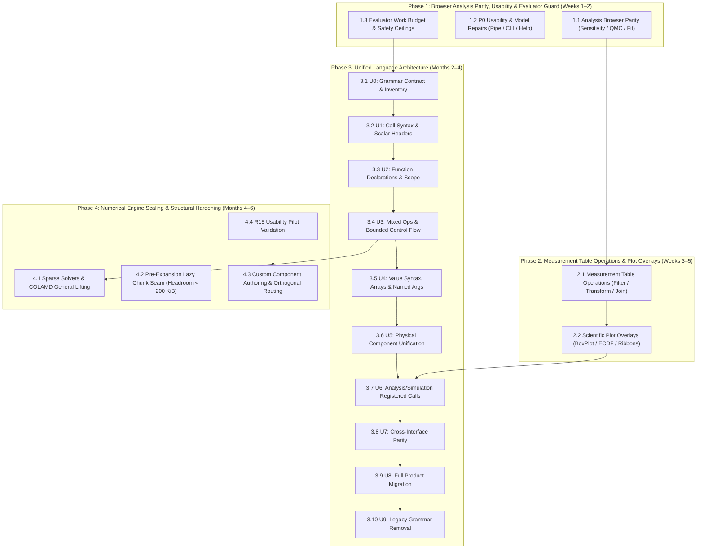

# Engineering Roadmap & Phased Execution Plan

This document outlines the phased engineering roadmap, active milestones, and quality acceptance gates for `frees` (`frees-wasm`).

---

## 1. Verified Architecture & Completed Milestones

The project provides an end-to-end client-side WebAssembly modeling platform with zero external backend dependencies:

- **Target-Agnostic Core ([`frees-core`](file:///home/eren/homecloud/dev/frees-wasm/crates/frees-core))**: Scaled Newton-Raphson, Powell hybrid dogleg, adaptive ODE integrators (`ode45`, `radau5`), index-1 DAE BDF/IDA solver with event root-finding, and an exact rational symbolic CAS.
- **Thermodynamic Property Backbone (`rustprop`)**: Pure-Rust CoolProp implementation supporting multiparameter Helmholtz energy equations of state, incompressibles (`INCOMP::MEG`, `MPG`), and ASHRAE moist air psychrometrics (`HAPropsSI`). 26 real fluids are linked and served on the diagram picker — every pure fluid [`props/propfun.rs`](file:///home/eren/homecloud/dev/frees-wasm/props/propfun.rs)'s alias table names.
- **WebAssembly Bridge & Worker Pool ([`frees`](file:///home/eren/homecloud/dev/frees-wasm/crates/frees), [`engineClient.ts`](file:///home/eren/homecloud/dev/frees-wasm/web/src/engineClient.ts))**: Zero-copy structured typed array boundary hosting a pool of up to 4 Web Workers with dynamic concurrency clamping, request correlation, weighted sweep progress, and deterministic row re-assembly.
- **Interactive Workbench ([`web`](file:///home/eren/homecloud/dev/frees-wasm/web))**: React 19 / TypeScript application featuring Glide Data Grid virtualized tables, Plotly.js scientific plotting with thermodynamic diagram overlays, CodeMirror/Monaco editor support, shareable URL links (`#share=<lz-string>`), and offline PWA caching via IndexedDB.
- **Experimental Data & Statistics ([`analysis/`](file:///home/eren/homecloud/dev/frees-wasm/crates/frees-core/src/analysis))**: Descriptive and inferential statistics (43 intrinsics including Student-t, Welch t-test, ANOVA, bootstrap, permutation tests), weighted/bounded/robust curve fitting and dynamic parameter calibration with parameter covariance, correlated and non-Gaussian input uncertainty ([`Correlation(A, B)`](file:///home/eren/homecloud/dev/frees-wasm/crates/frees-core/src/analysis/uncertainty.rs) / [`DistributionOf(X)`](file:///home/eren/homecloud/dev/frees-wasm/crates/frees-core/src/analysis/distributions.rs)), truncated inverse-CDF sampling, seeded Latin-hypercube and scrambled Sobol designs, Sobol' variance decomposition and Morris screening, and $O(n \log n)$ arbitrary-length transforms with sensor kernels ([`Detrend`](file:///home/eren/homecloud/dev/frees-wasm/crates/frees-core/src/signal.rs), [`Smooth`](file:///home/eren/homecloud/dev/frees-wasm/crates/frees-core/src/signal.rs), [`Window`](file:///home/eren/homecloud/dev/frees-wasm/crates/frees-core/src/signal.rs), [`Filter`](file:///home/eren/homecloud/dev/frees-wasm/crates/frees-core/src/signal.rs), [`FiltFilt`](file:///home/eren/homecloud/dev/frees-wasm/crates/frees-core/src/signal.rs), [`XCorr`](file:///home/eren/homecloud/dev/frees-wasm/crates/frees-core/src/signal.rs), [`Welch`](file:///home/eren/homecloud/dev/frees-wasm/crates/frees-core/src/signal.rs), peak detection).
- **Strict Quality Gates**: 1,308 golden regression fixtures passing with zero regressions, four-shard compiled WASM golden-corpus replay in CI, 56 frontend Vitest test suites (624 tests) passing, clean clippy `-D warnings` on native and `wasm32-unknown-unknown`, automated documentation and example validation in CI, and the WASM bundle strictly gated under the 5,120 KiB ceiling (~3,888 KiB raw, leaving 1,232 KiB headroom).

### Summary of Completed Engineering Milestones

The following earlier milestones have been fully implemented, verified, and integrated into `main`:

1. **Phase 1: Operational Wins & Governance**
   - Node 22 pinned in [`web/package.json`](file:///home/eren/homecloud/dev/frees-wasm/web/package.json) and `.nvmrc`.
   - Automated supply-chain hardening (`cargo audit`, `cargo deny`, `npm audit`) and formal [`SECURITY.md`](file:///home/eren/homecloud/dev/frees-wasm/SECURITY.md).
   - Release engineering automated via Release-Please with tag `v0.1.0` and multi-platform binary assets.
   - Standing offline ("no-network") Playwright test suite blocking regressions in browser caching.
   - Formal [`CONTRIBUTING.md`](file:///home/eren/homecloud/dev/frees-wasm/CONTRIBUTING.md) and issue templates.
2. **Phase 2: Robustness, Performance & Verification**
   - Zero-copy typed array WASM boundary via `js_sys::Float64Array` and transferable `ArrayBuffer` views.
   - Parser and expression fuzz testing via `cargo-fuzz` / `libFuzzer` in [`fuzz/`](file:///home/eren/homecloud/dev/frees-wasm/fuzz).
   - Cross-platform CI matrix with macOS runner and multi-browser Playwright matrix (Chromium, Firefox, WebKit).
   - Interactive Pareto point-click inspection and document operating-point loading in [`web/src/MinMaxModal.tsx`](file:///home/eren/homecloud/dev/frees-wasm/web/src/MinMaxModal.tsx).
3. **Phase 4 (Core Numerics): Statistical Analysis & Signal Kernels**
   - Statistical foundations and inference intrinsics in [`crates/frees-core/src/descriptive.rs`](file:///home/eren/homecloud/dev/frees-wasm/crates/frees-core/src/descriptive.rs) (4.1).
   - Weighted and bounded fitting with parameter covariance SVD in [`analysis/curvefit.rs`](file:///home/eren/homecloud/dev/frees-wasm/crates/frees-core/src/analysis/curvefit.rs) and dynamic calibration in [`paramfit.rs`](file:///home/eren/homecloud/dev/frees-wasm/crates/frees-core/src/analysis/paramfit.rs) (4.2).
   - Correlated inputs and non-Gaussian uncertainty distributions with truncated inverse-CDF sampling (4.3).
   - Sensor signal processing kernels and $O(n \log n)$ Bluestein/Cooley-Tukey FFT/IFFT (4.5).
   - QMC sampling (Latin-hypercube, Sobol) and global sensitivity (Sobol indices, Morris screening) (4.6).
4. **Documentation & Example Verification Infrastructure**
   - Documentation gate repaired to reconcile against live Rust registries ([`eval::INTRINSICS`](file:///home/eren/homecloud/dev/frees-wasm/crates/frees-core/src/eval.rs), [`EXPANDED_CALL_TARGETS`](file:///home/eren/homecloud/dev/frees-wasm/crates/frees-core/src/procedures.rs), [`MATRIX_FUNCTIONS`](file:///home/eren/homecloud/dev/frees-wasm/crates/frees-core/src/parser/expand.rs)); provenance fixed; tests added (Phase 4.7b-1, PR #24).
   - Automated example runner ([`web/scripts/check-doc-examples.mjs`](file:///home/eren/homecloud/dev/frees-wasm/web/scripts/check-doc-examples.mjs)) executing fences against compiled WASM with numerical `{ CHECK ... }` assertions wired into CI (PR #24).
   - 19 verified worked engineering models landed into gallery with numerical assertions and reference bindings (Phase 4.7b-2, PR #25).
   - 56 missing reference pages authored and catalogued, bringing reference presence to 723 symbols (Phase 4.7b-3, PR #26).
   - Electrical component domain coverage wave B models landed with `CHECK` assertions (PR #28).

---

## 2. Phased Implementation Plan

The current active roadmap addresses actionable findings from the latest reports in [`reports/`](file:///home/eren/homecloud/dev/frees-wasm/reports): the usability audit ([`reports/REPORT.md`](file:///home/eren/homecloud/dev/frees-wasm/reports/REPORT.md)), the language unification proposal ([`reports/SIMPLIFIED_SYNTAX_PROPOSAL.md`](file:///home/eren/homecloud/dev/frees-wasm/reports/SIMPLIFIED_SYNTAX_PROPOSAL.md)), and foundational table/plot reviews.



---

### Phase 1: Browser Analysis Parity, Usability & Evaluator Guard (Target: Weeks 1–2)

Focus: Expose recently implemented Rust analysis capabilities to the web application, repair high-priority onboarding and documentation defects identified in the audits ([`reports/REPORT.md`](file:///home/eren/homecloud/dev/frees-wasm/reports/REPORT.md)), and protect the engine against runaway nested evaluator work.

- [x] **1.1 Browser UI & Worker Parity for Scientific Analysis**
  - **Global Sensitivity Endpoint**: Wire the WASM sensitivity endpoint in [`crates/frees/src/analysis.rs`](file:///home/eren/homecloud/dev/frees-wasm/crates/frees/src/analysis.rs) into [`web/src/wasm/engine.worker.ts`](file:///home/eren/homecloud/dev/frees-wasm/web/src/wasm/engine.worker.ts) and [`web/src/api.ts`](file:///home/eren/homecloud/dev/frees-wasm/web/src/api.ts). Add a user-facing sensitivity dialog allowing selection of parameters, sample size, and method (Sobol / Morris), rendering $S_1$, $S_T$, and screening rankings.
  - **Stratified & QMC Monte Carlo Options**: Extend `MonteCarloParams` in [`web/src/api.ts`](file:///home/eren/homecloud/dev/frees-wasm/web/src/api.ts) to send `design` (`"iid"`, `"lhs"`, `"sobol"`) and requested output `quantiles`. Expose these controls in `MonteCarloModal.tsx` and display empirical quantiles and standard error validity flags (`iidStandardErrorApplies`).
  - **Parameter Fitting Diagnostics & Weighting UI**: Update `ParameterFitParams` and `ParameterFitResult` in [`web/src/api.ts`](file:///home/eren/homecloud/dev/frees-wasm/web/src/api.ts) to support measurement standard deviation (`sigma`), robust loss selection (`loss`, `fScale`), and receive parameter standard errors, covariance matrices, residual DOF, rank, condition number, and `atBound` flags. Display these diagnostics in the parameter calibration dialog.
- [x] **1.2 High-Priority Usability, Contract & Model Repairs**
  - **Pipe Roughness Specification**: Resolve the contract contradiction identified in the audit: [`components/library-data/fluid.frees:67`](file:///home/eren/homecloud/dev/frees-wasm/components/library-data/fluid.frees) and the `Pipe` reference pass `rough / D` to the friction factor, which means absolute roughness in metres, whereas documentation text claimed relative roughness. Update the documentation, add unit checking `[m]`, and create a validated pipe pressure drop test model.
  - **Help Models Repair**: Fix [`cd-nozzle-shock`](file:///home/eren/homecloud/dev/frees-wasm/web/src/helpExamples.ts) by adding explicit `GUESS Me = 2.9` to prevent division-by-zero, and fix [`forced-response-lsim`](file:///home/eren/homecloud/dev/frees-wasm/web/src/helpExamples.ts) by properly quoting plot labels (`'Time [s]'`, `'Output'`).
  - **CLI Quick-Start Correction**: Update `README.md` and CLI guides to remove references to the obsolete `--json` flag (CLI emits structured JSON by default), documenting `--request`, batch solving via stdin/files, solver options, and process exit codes.
  - **Onboarding Alignment**: Synchronize [`web/src/GettingStartedModal.tsx`](file:///home/eren/homecloud/dev/frees-wasm/web/src/GettingStartedModal.tsx) and [`web/src/defaultExample.ts`](file:///home/eren/homecloud/dev/frees-wasm/web/src/defaultExample.ts) so the modal accurately describes the loaded introductory model and removes stale warnings claiming optimization, fitting, and Monte Carlo are un-wired.
- [x] **1.3 Cumulative Evaluator Work-Budget & Execution Guard**
  - Implement a shared, decrementing evaluation and expansion budget across reductions, nested user calls, ordered loops, array generation, and numerical probing in [`crates/frees-core/src/eval.rs`](file:///home/eren/homecloud/dev/frees-wasm/crates/frees-core/src/eval.rs).
  - Replace unbounded loop limits (such as the $2^{24}$ limit in `eval_reduction`) with a deterministic cumulative budget that prevents nested workloads and fuzz artifacts from hanging the Web Worker or CLI process.
  - Provide clean, structured timeout/budget exhaustion errors crossing the WASM boundary, preserving solver domain-error backtracking during Newton iterations.

---

### Phase 2: Measurement Table Operations & Scientific Visualization (Target: Weeks 3–5)

Focus: Expand table data wrangling and plotting workflows (Phase 4.4 from earlier planning, reinforced by table and plot engine reviews) so that experimental data feeds seamlessly into physical calibration, regression, and visualization.

- [x] **2.1 Practical Measurement Table Operations**
  - **Data Wrangling Kernels**: Implement row filtering (predicate expressions), selected-column mathematical transforms, grouped summaries (group-by with aggregation), and rolling statistics (moving mean, standard deviation, median) within the Tables tab.
  - **Table Joins & Temporal Alignment**: Add join operations by key column or timestamp, supporting exact matching and linear interpolation for mismatched time grids.
  - **Data Provenance & Policy Controls**: Provide explicit handling for missing values (`NaN`), rejected rows, duplicate keys, and out-of-bounds extrapolation. Ensure unit metadata and column descriptions are preserved across transforms.
  - **Direct Pipeline Feed**: Allow derived and filtered tables to be selected as data sources for curve fitting, dynamic parameter calibration, and parametric sweep comparisons without manual CSV re-export.
- [x] **2.2 Advanced Scientific Plot Overlays & Interaction**
  - **Statistical Plot Types**: Integrate Box Plots and Empirical Cumulative Distribution Functions (ECDFs) into the Plot tab using the existing Plotly.js engine.
  - **Uncertainty & Fit Overlays**: Plot fitted curve overlays with translucent confidence ribbons ($95\%$ mean confidence band) and prediction ribbons (prediction intervals accounting for measurement variance) directly atop scatter data points.
  - **Binding Correctness & Missing Data**: Fix plot-to-table binding identity so switching active tables does not inadvertently scramble plot definitions; properly break line segments across missing (`NaN`) samples rather than drawing erroneous bridging lines.

---

### Phase 3: Unified Language Architecture (Target: Months 2–4)

Focus: Implement the comprehensive language unification detailed in [`reports/SIMPLIFIED_SYNTAX_PROPOSAL.md`](file:///home/eren/homecloud/dev/frees-wasm/reports/SIMPLIFIED_SYNTAX_PROPOSAL.md). Unify equations and procedural algorithms under one `function` declaration, single/bracketed call syntax, explicit operators (`=` for equations, `:=` for ordered calculations, `==` for comparisons), and replace disparate block keywords (`CALL`, `MODULE`, `PROCEDURE`, `COMPONENT`) with registered domain calls.

- [x] **3.1 Stage U0: Language Contract, Callable Inventory & Migration Semantics**
  - Formally freeze operator semantics, lexical scoping rules, type/value representations, and migration diagnostics as defined in [`reports/SIMPLIFIED_SYNTAX_PROPOSAL.md`](file:///home/eren/homecloud/dev/frees-wasm/reports/SIMPLIFIED_SYNTAX_PROPOSAL.md).
  - Catalogue all callable signatures across built-in intrinsics, matrix routines, CoolProp thermodynamic queries, signal processing, and component libraries.
  - Establish a golden compatibility test suite capturing legacy behavior across all edge cases (descending loops, caller-scope access, ignored equations, output re-execution).
- [ ] **3.2 Stage U1: Unified Call Syntax & Scalar Output Headers**
  - [x] Extend the parser to accept scalar output headers: `function y = f(x)` alongside existing multi-output `function [a, b] = f(x)`.
  - [x] Allow single-result procedures to be called as standard expressions (`y = proc(x)`) lowering through single-result expression sinks, eliminating the artificial requirement for bracket assignment.
  - [x] Unify signature resolution so that built-ins, tables, procedures, and user functions share identical dispatch, named-argument binding, and arity diagnostics across native and WASM builds.
- [ ] **3.3 Stage U2: Unified Function Declarations & Lexical Scoping**
  - Unify `function` declarations: lower declarative equation functions through the module expansion path and ordered algorithmic functions through the procedure execution path.
  - [x] Introduce strict lexical scoping for canonical user functions, preserving legacy dynamic scope during migration.
  - [x] Detect and flag equations inside canonical function bodies that lack variable sides (which legacy procedures silently ignored) rather than silently discarding them.
- [ ] **3.4 Stage U3: Mixed Operations & Bounded Control Flow**
  - Implement definite assignment and variable versioning to support mixed equation and calculation bodies:
    - Numerical `=` declares mathematical equations (participating in global nonlinear/ODE solve).
    - `:=` performs explicit ordered calculations and accumulator updates.
    - [x] Canonical function bodies execute variable assignments and calculations in source order, with later reads observing the latest value.
    - [x] Canonical function bodies validate definite assignment across branches before execution.
  - [x] Introduce clean colon-based range loops (`for i = 1:n`) with explicit step support and bounded iteration ceilings.
    - [x] Canonical two-bound colon ranges default to `+1`; descending ranges require an explicit negative step.
  - Enforce static checks ensuring that runtime control flow does not alter the structural topological graph of nonlinear equations during Newton iterations.
    - [x] Structural equation preparation remains value independent and is cached across Newton iterations.
- [ ] **3.5 Stage U4: Value Syntax, Array Indexing & Named Arguments**
  - Unambiguously resolve array indexing versus function calls: support parenthesized indexing `a(i)` alongside `a[i]` with 1-based indexing checks and index-zero diagnostics.
    - [x] Resolve parenthesized indexing for array bindings introduced by array literals and `range(...)` independently of statement order, using the existing one-based index evaluator.
  - Implement named argument support (`func(x, tolerance = 1e-6, method = 'bdf')`) across intrinsics and user functions.
    - [x] Bind named arguments for intrinsic, user-function, and procedure calls with duplicate, unknown, missing, and ordering diagnostics.
  - Add typed value checking for non-numeric types (strings, symbols, options) and clean syntax for initial conditions.
    - [x] Parse canonical `initial(state, value)` calls in dynamic functions and route them through the existing initial-condition validation.
    - [x] Parse canonical `guess(name, value, lower=..., upper=...)` solver seed calls with bound validation.
- [ ] **3.6 Stage U5: Physical Component & Connection Unification**
  - Migrate physical component definitions from legacy `COMPONENT ... END` blocks to unified component declarations.
    - [x] Lower `function [ports] = name(parameters)` declarations containing `port(...)` into the existing component definition pipeline.
  - Unify port declarations, parameter defaults, constitutive equations, and acausal connection statements (`connect(node_a, node_b)`).
    - [x] Canonical `require(...)` calls parse as ordinary expressions for selected component branches.
    - [x] Lower canonical `port(...)` and `connect(...)` statements into component ports and connection declarations.
    - [x] Preserve defaults declared in unified component function parameters through component expansion.
    - [x] Lower canonical `variant name require(...)` blocks into the existing construction-time variant model.
  - Verify that physical conservation (Kirchhoff current/pressure laws), state storage, and structural variants produce identical topological networks and numerical solutions.
    - [x] Lowered unified definitions reuse the existing component expander's conservation and topology path; pressure/flow expansion and variant parsing are covered by U5 tests.
- [ ] **3.7 Stage U6: Analysis, Simulation & Presentation as Registered Calls**
  - Replace ad-hoc keyword blocks with registered domain function calls: `simulate(...)`, `sweep(...)`, `plot(...)`, `table(...)`, `linearize(...)`.
    - [x] Domain calls `simulate(...)`, `sweep(...)`, `plot(...)`, `table(...)`, and `linearize(...)` parse in ordinary expression position.
    - [x] Reserved `state_table(...)` parses in ordinary expression position.
  - Maintain explicit run ownership, result bindings, and feedback paths without separate grammar modes.
- [ ] **3.8 Stage U7: Cross-Interface Analysis Parity**
  - Align analysis execution schemas (optimization, fitting, sensitivity, uncertainty propagation, Monte Carlo) across CLI, WASM Web Worker, and UI dialogs.
    - [x] Expose the existing sensitivity endpoint through the WASM facade and route all existing analysis endpoints through a shared CLI dispatcher.
  - [x] Enable scripts to invoke sensitivity, calibration, and sweep routines programmatically through the shared `frees-cli analyze OP --request ...` facade.
- [ ] **3.9 Stage U8: Product-Wide Migration**
  - Convert all standard library definitions ([`components/library-data/`](file:///home/eren/homecloud/dev/frees-wasm/components/library-data)), gallery models ([`web/src/examples.ts`](file:///home/eren/homecloud/dev/frees-wasm/web/src/examples.ts)), Help models, and test fixtures to the unified syntax.
  - Update editor language tooling: syntax highlighters ([`web/src/EquationEditor.tsx`](file:///home/eren/homecloud/dev/frees-wasm/web/src/EquationEditor.tsx)), autocompletion ([`web/src/editorCompletion.ts`](file:///home/eren/homecloud/dev/frees-wasm/web/src/editorCompletion.ts)), signature tooltips ([`web/src/signatureHelp.ts`](file:///home/eren/homecloud/dev/frees-wasm/web/src/signatureHelp.ts)), and LaTeX renderer.
  - Provide an automatic project migration tool for legacy projects, embedding a version header (`// frees-language: 2`).
    - [x] Add `frees-cli migrate` for unambiguous function, procedure, call, and guess rewrites, with explicit refusal for model-specific blocks.
    - [x] Autocomplete and local signatures recognize unified component function headers and port(...) declarations.
    - [x] Syntax highlighting includes canonical control flow, initial-condition, run, port, and check vocabulary.
- [ ] **3.10 Stage U9: Legacy Grammar Removal & Deprecation**
  - Conclude the versioned compatibility transition.
  - Restrict legacy grammar (`CALL`, `MODULE`, `PROCEDURE`, `COMPONENT`) to explicit migration/import converters.
  - [x] Version-2 documents reject all four legacy declaration forms with the migration diagnostic.
  - [x] The migration converter is the explicit import path for supported legacy forms and refuses ambiguous module/component rewrites.
  - [x] The editor no longer highlights legacy declaration keywords as normal version-2 language keywords.
  - Strip obsolete keywords and grammar paths from the production parser and compiler, locking in a compact, unified language core.

---

### Phase 4: Numerical Engine Scaling & Structural Hardening (Target: Months 4–6)

Focus: Address large-scale system scalability, resolve structural thermodynamic data debt, implement advanced schematic layout features, and execute formal human usability validation.

- [ ] **4.1 Sparse Matrix Factorization & Graph Reordering**
  - Lift and extend the internal COLAMD-lite ordering from [`crates/frees-core/src/dae/colamd.rs`](file:///home/eren/homecloud/dev/frees-wasm/crates/frees-core/src/dae/colamd.rs) to serve the general equation solver.
  - Implement full Approximate Minimum Degree (AMD) and Column Approximate Minimum Degree (COLAMD) permutations with supercolumn absorption.
  - Implement sparsity pattern caching across Newton-Raphson iterations to avoid repeated symbolic factorization when solving large systems (>5,000 equations).
  - Evaluate integration of pure-Rust sparse factorization kernels (`faer` / `sprs`) against dense fallbacks.
- [ ] **4.2 Pre-Expansion Lazy Chunk Seam for Thermodynamic Data**
  - Implement dynamic, asynchronous fetching for property tables and component libraries via [`props/tables.rs::install_from_bytes`](file:///home/eren/homecloud/dev/frees-wasm/props/tables.rs).
  - Establish a pre-solve document scan to fetch required fluid tables on first reference before the solver worker executes.
  - **Trigger Condition**: Headroom below 200 KiB against the 5,120 KiB WASM ceiling, or before requesting any future budget increase. (Current headroom: 1,232 KiB; 3,888 KiB raw).
- [ ] **4.3 Custom Component Authoring & Advanced Schematic Routing**
  - **Canvas Encapsulation**: Provide a visual canvas interaction in [`web/src/schematic/`](file:///home/eren/homecloud/dev/frees-wasm/web/src/schematic) allowing users to select a group of connected components and encapsulate them into a reusable custom component block with exposed external ports.
  - **Orthogonal Wire Routing**: Replace simple direct connections in [`web/src/schematic/layout.ts`](file:///home/eren/homecloud/dev/frees-wasm/web/src/schematic/layout.ts) with an obstacle-avoiding orthogonal wire router that neatly navigates around existing component blocks.
- [ ] **4.4 R15 Usability Pilot Validation**
  - Execute the structured R15 usability pilot with 5 engineering participants according to [`R15_PILOT.md`](file:///home/eren/homecloud/dev/frees-wasm/R15_PILOT.md).
  - Test core engineering tasks: scalar solve within 5 minutes, component chain within 10 minutes, and missing boundary diagnostic recovery within 3 minutes.
  - Record qualitative feedback, assistance requirements, and task completion times to guide workbench UX improvements.

---

## 3. Deferred & Long-Term Candidates

To ensure engineering resources remain focused on engine reliability, analysis parity, and the unified language architecture, the following documentation and research tracks are explicitly deferred to this section.

### 3.1 Deferred Documentation & Example Programmes

These items expand user-facing documentation, written tutorials, and reference examples once language unification and UI analysis features stabilize:

- **Deferred — D.1 Component Domain Example Wave B (Remaining Tranches B1–B15, B19–B29)**:
  - Curated engineering problems from the reference bank covering pneumatic (B1–B3), hydraulic (B4–B6), mechanical/powertrain (B7–B9), control (B10–B12), moist air (B13–B15), heat transfer (B19–B21), and uncertainty/sensitivity (B22–B29).
  - Electrical tranche (B16–B18, B30) was completed in PR #28. The remaining tranches will be landed in targeted batches adhering to complete-document verification and `{ CHECK ... }` assertion standards.
- **Deferred — D.2 Component Domain Example Wave C (Large Fluid & Two-Phase Systems)**:
  - Dedicated worked examples for the largest uncovered component domains: Two-Phase (38 components), Fluid (26 components), and Liquid (15 components), including refrigeration cycles, pipe networks, and pump curves.
- **Deferred — D.3 Comprehensive Documentation & Public Example Gallery ("The frees Book")**:
  - Build an mdBook compiling language syntax, physical modeling principles, thermodynamic EoS fundamentals, and solver debugging guides.
  - Curate a public gallery of 30–50 verified engineering models from the regression corpus with interactive simulation previews.
- **Deferred — D.4 Cross-Library Reference Validation Fixtures**:
  - Author reproducible cross-library reference fixtures generated from NumPy, SciPy, statsmodels, and SALib (with exact seeds, versions, and estimator conventions recorded) to validate statistics and fitting kernels offline without runtime Python dependencies.

### 3.2 Long-Term Strategic, Research & Infrastructure Candidates

- **Deferred — Standalone Language Server ([`crates/frees-lsp`](file:///home/eren/homecloud/dev/frees-wasm/crates))**: Dedicated LSP server communicating over stdio to provide real-time diagnostics, syntax highlighting, unit checking, and autocomplete in external editors (VS Code, Neovim, Helix).
- **Deferred — Standalone Simulation Code Export (Python & C++)**: AST visitor exporting solved equation models to standalone Python scripts (SciPy `fsolve`/`solve_ivp`) or header-only C++ numerical code.
- **Deferred — Crates.io Publishing for Dependencies & Core Engine**: Publish `rustprop`, `frees-core`, and `frees-cli` to crates.io once API contracts and upstream dependencies stabilize.
- **Deferred — SharedArrayBuffer Multi-Threading**: Research cross-origin isolation (`COOP`/`COEP`) headers for zero-copy multi-threaded sweeps, with seamless fallback for standard static hosting environments.
- **Deferred — Neural & Domain-Bounded Surrogate Property Models**: Train bounded surrogate evaluators for fast property estimation during Newton line-search steps, with exact Helmholtz verification at convergence.
- **Deferred — Standards Interoperability (FMI / FMU 2.0/3.0)**: Package dynamic systems as Functional Mock-up Units for co-simulation in industrial engineering workflows.
- **Deferred — Accessibility & Touch Ergonomics**: Full WCAG 2.1 AA compliance, enhanced screen reader announcements, and tactile multi-touch canvas navigation.

---

## 4. Quality & Change Control Acceptance Gates

Every proposed change to the codebase must pass all automated verification gates prior to integration:

### 1. Rust Engine Quality Gates

```bash
# Code formatting check
cargo fmt --all --check

# Strict linting across native and wasm targets
cargo clippy --workspace --all-targets -- -D warnings
cargo clippy --workspace --target wasm32-unknown-unknown --all-targets -- -D warnings

# Core unit and integration test suite
cargo test --workspace -- --skip golden_corpus_parity

# Full golden regression corpus replay (1,308 fixtures)
cargo test --release --test parity
```

- **Zero Regression Policy**: All 1,308 golden fixtures must pass within declared tolerance specifications ([`fixtures/tolerances-rustprop.json`](file:///home/eren/homecloud/dev/frees-wasm/fixtures/tolerances-rustprop.json)).
- **Dead Tolerance Detection**: Relaxed tolerances that become unnecessary must be removed; CI fails if an unused tolerance entry remains.

### 2. Frontend & WebAssembly Gates

```bash
# Frontend test suite (Node 22 required)
cd web && npm test

# ESLint code quality verification
npm run lint

# Documentation and example consistency gates
npm run check-docs
npm run check-examples

# Production bundle compilation and PWA asset generation
npm run build
```

- **Node 22 Toolchain Requirement**: Pinned in `web/.nvmrc` and enforced via `web/package.json`.
- **Bundle Budget Ceiling**: The compiled WebAssembly engine (`frees.wasm`) must strictly remain $\le 5,120	ext{ KiB}$ raw (measured at ~3,888 KiB). Any PR exceeding this budget fails CI automatically. Raising this ceiling requires completing the lazy-chunk split (Phase 4.2).
- **Executable Documentation**: All guide code fences and gallery models with `CHECK` markers must solve and assert expected values through [`web/scripts/check-doc-examples.mjs`](file:///home/eren/homecloud/dev/frees-wasm/web/scripts/check-doc-examples.mjs) during CI.

### 3. Language Migration Acceptance Matrix

Changes implementing Phase 3 (Unified Language) must satisfy the following verification matrix:

| Case | Required Assertion |
|---|---|
| Equation function solved forward and backward | Same equations/results within existing tolerances; no local solve that severs dependencies. |
| Nested single-output call and multi-output matrix/signal call | Correct output order, shapes, units, and private namespaces. |
| Discarded or omitted outputs | Internal constraints retained; unassigned outputs do not alter the system. |
| Ordered accumulator and mixed root/correction example | Correct updates and dependency order; no read-before-assignment. |
| Equation-only statement in an algorithm migration | Preserved deliberately or flagged with an actionable diagnostic; never silently ignored. |
| Module or component instantiated multiple times | Independent locals, states, and output references. |
| Lookup table called like a function | Identical interpolation, units, family, and boundary policies. |
| Array access versus function call versus initial condition | Deterministic resolution, including invalid index zero diagnostics. |
| Sweep of a defaulted formal input | Exactly one effective input value per row; hard-coded constraints are not overwritten. |
| ODE, stiff ODE, DAE, event reset, and coupled accessor solve | Existing result/event tolerances, consistent initialization, and feedback. |
| Structural variant with unknown selector | Clear preparation error, not a changing Newton graph. |
| Linearization / fitting / sampling / sensitivity | Existing diagnostics/settings reach native, WASM, and browser interfaces identically. |
| Metadata, plot, and check calls | Excluded from equation balance counts; executed in the correct phase. |
| Legacy import and new text export | Version preserved, conversion review available, round-trip fidelity verified. |
