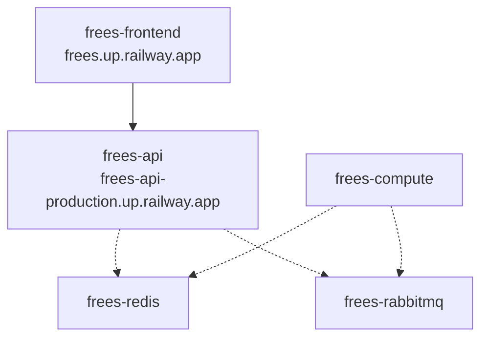

# frees

**free solver** — a web-based, open-source equation-solving environment for engineers.

Solves systems of non-linear simultaneous equations: ANTLR-parsed equations are decomposed into sequentially solvable blocks (bipartite matching + Tarjan SCC) and solved with Newton's method with step-halving, behind a Spring Boot REST API with a React/TypeScript front end.

## Features

- **Equations & Markdown Editor**: A custom-designed monospace text editor with line numbers, allowing you to write equations intermixed with standard Markdown notes.
- **Formatted Report View**: Automatically extracts and evaluates equations (including inline variables like `T1 = 100 [C]`), rendering them as beautiful LaTeX/KaTeX math blocks alongside standard Markdown text.
- **Embedded Interactive Plots**: Embed active property diagrams, psychrometric charts, or X-Y plots directly in formatted reports using the tag `[Graph="Diagram Name"] Caption [/Graph]`, featuring automatic figure numbering and interactive Plotly controls.
- **Inline Solution Tooltips**: Hover over variables in equations within the Formatted View to inspect their solved values and units dynamically.
- **REPL Terminal & Workspace**: A dockable, interactive console window (movable like the Editor and Variable Explorer) that evaluates one line at a time against the live workspace — a unit-aware calculator with history and Tab-completion. Query and assign variables, build matrices/ranges, solve a single unknown implicitly, run the full `CALL` library (with output lengths sized automatically so you can write bare output names), and use the embedded **Symja** CAS interactively (`Factor`, `Expand`, `Simplify`, `Together`, `Cancel`, `Collect`, `Diff`, `Integrate`, `Apart`, `Laplace`, `InverseLaplace`). A MATLAB-style variable explorer lists the workspace alongside it.
- **Robust Math Solver**: Decomposes systems of equations into blocks via bipartite matching + Tarjan SCC, solved with Newton's method and step-halving.
- **Matrix & Vector Algebra**: 2D matrix variables (`A[1,1] = 2; A[1,2] = 1` — multiple equations per line), array literals (`b[1..3] = [8, -11, -3]`), and linear-algebra operations (`SolveLinear`, `Inverse`, `Transpose`, `Determinant`, `Dot`, `Cross`, `Norm`, `LUDecompose`, `Eigenvalues`/`Eigen`, Euler rotations) that expand into scalar equations and solve alongside the rest of the system. Matrices render as grids in the Arrays window and as KaTeX block matrices in reports.
- **Control Systems & Symbolic CAS**: MATLAB-Control-Toolbox-style analysis as native equations — LTI models as plain arrays/matrices (TF `num`/`den`, state space `A,B,C,D`, ZPK), conversions (`tf2ss`, `ss2tf`, `zp2tf`, `tf2zp`), interconnection (`series`, `parallel`, `feedback`), poles/zeros and stability margins (`pole`, `zero`, `margin`), frequency response (`bode`, `nyquist`) and time response (`step`, `impulse`, `lsim`) with dedicated interactive plots, and state-feedback/PID design (`lqr`, `place`, `pidtune`). `CALL` output array lengths are inferred from the inputs, so outputs can be written as bare names. Every multi-output `CALL` function also accepts MATLAB-style destructuring — `[A, B, C, D] = tf2ss(num, den)` is identical to the `CALL … : …` form — with `~` to discard an output (`[~, ~, V] = svd(M)`) and trailing-output omission (`[A, B] = tf2ss(num, den)`). An embedded Symja CAS additionally solves **symbolic identities** — e.g. Laplace partial-fraction decomposition (`SYMBOLIC s`, `tf(...)`) whose residues become ordinary solved variables — and its symbolic transforms (`Factor`, `Apart`, `Laplace`, `InverseLaplace`, `Diff`, `Integrate`, …) are available interactively in the REPL terminal.
- **Thermodynamic Property Database**: Built-in support for fluid state lookups using CoolProp (and psychrometrics / humid air), overlaid onto interactive property diagrams.
- **Component-Based System Modeling**: An acausal, multi-domain modeling layer (`COMPONENT … END` blocks with typed ports) for building engineering *systems* — power cycles, refrigeration/HVAC, flow networks, EV thermal & powertrain — not just bare equations. Components are reusable, parameterized templates of acausal equations; instantiating and `connect`-ing them (or sharing stream names) expands to scalar equations that flow through the existing Newton/Tarjan solver unchanged — a thin parser/expander layer, not a new solver. Four physical domains (fluid `(P, ṁ, h)`, heat `(T, Q̇)`, electrical `(V, I)`, mechanical rotational `(τ, ω)` / translational `(F, v)`) with per-domain junction rules (across-equal, Σflow=0 — a pseudo-bond-graph), a `model$` fidelity-variant selector ("one component, many models"), steady **and** transient operation (storage elements → `DYNAMIC` `der()` states), and plant→control linearization (`LINEARIZE` → `(A,B,C,D)` → `lqr`/`place`). Ships a ~90-component standard library spanning power/refrigeration cycles, two-phase thermofluid (Lockhart–Martinelli pipes, superheat-controlled TXV, multi-zone heat exchangers), **humid-air HVAC** (cooling/heating coils, humidifier, economizer mixing box), **pneumatic** (ISO 6358 valves/cylinders) and **oil-hydraulic** (orifices, relief valves, cylinders, positive-displacement pumps) fluid power, electrical/battery (R-int/1RC/2RC Thévenin) and a **PEMFC fuel cell**, mechanical/powertrain (mean-value engine, transmission, road-load), and gas-mixture composition transport. Connector types are **strictly separated** — a `connect` node must be one domain, and the fluid-family types (thermofluid / pneumatic `gas` / hydraulic `oil` / humid-air `moistair`) that share the `(P, ṁ, h)` bond are type-checked so a gas line can't be wired to an oil or steam line. With source-mapped diagnostics and an auto-generated Mermaid topology view, frees sits in the 0-D lumped band of Modelica/Simscape but web-based and fully equation-transparent.
- **Calculus, Complex & Special Functions**: Numerical integration of expressions and first-order ODEs (`Integral`), complex-number arithmetic, a broad special-function library (Bessel `J`/`I`/`Y`/`K` of all orders, error/gamma/beta functions), and statistical functions (Chi-Square CDF `chi_square(x, df)`, normal probability ranges `probability(x1, x2, mean, stdDev)`).
- **Uncertainty Propagation**: Propagates measurement/parameter uncertainties (specified as absolute or relative values in the Variable Information window, or defined via equations like `UncertaintyOf(X) = <expr>`) through implicit systems of simultaneous equations using numerical Jacobians and Singular Value Decomposition (SVD). Allows querying calculated uncertainties inside the model using the `UncertaintyOf(X)` accessor (e.g., `u_T = UncertaintyOf(T)`). Propagated uncertainties are displayed as `val ± unc` in the Solution window.
- **Optimization**: Single- and multi-variable minimization/maximization (Brent, Nelder–Mead Simplex, BOBYQA) with bound and constraint handling (log-barrier inequalities, augmented-Lagrangian equalities).
- **Graph Digitizer & Function Tables**: Trace data off a scanned chart and call the resulting curve as a function inside your equations, or define tabulated/interpolated functions.
- **Interactive Diagram Window & Live Dashboards**: A vector schematic editor whose labels, gauges, and embedded Plotly charts read live from the solver — with conditional formatting, animation/flow, parametric-table playback, recording, templates, and SVG/PNG/PDF export.
- **Whiteboard**: An [Excalidraw](https://excalidraw.com) freehand sketch canvas complementing the solver-bound Diagram window — hand-drawn shapes, text, and pasted images for quickly sketching out a problem. Each whiteboard is a managed dock window that round-trips with your project (saved into the `.frees` file) and exports to PNG/SVG.

## Architecture and System Design

The application operates on a **Decoupled Asynchronous Client-Server model**.

1. The **React Frontend** provides a multi-window dashboard representing the Editor, Formatted Report, Solution, Arrays, Residuals, Parametric Tables, Plot, Diagram, and Whiteboard windows.
2. The user inputs text containing equations and standard Markdown notes. Upon pressing "Solve" or "Check", the frontend posts the text string to the **Spring Boot API Node** (`api` profile).
3. The **API Node** performs syntax validation and pushes the compute payload to a **RabbitMQ** task queue, responding with a `202 Accepted` job ID.
4. The **Compute Node** (`compute` profile) asynchronously consumes the task, extracts equations, lexes/parses them, builds an Abstract Syntax Tree (AST), blocks equations via Tarjan's algorithm, solves them using a numerical Jacobian matrix, and writes the JSON payload containing solutions and formatted reports to **Redis**.
5. The frontend polls the API node until completion, retrieves the payload from Redis, and dynamically renders the formatted report, equations, interactive plots, and solution grids.

### Markdown Equation Extraction

The backend separates equations from prose before parsing (`MarkdownEquationExtractor`):

- **Pure equation lines** — a line whose entire content tokenizes as math (identifiers, numbers, `[unit]` annotations, operators, subscripts) is passed to the parser as-is. Markdown lines (`#`, `-`, `*`, `>` prefixes) and free text are excluded.
- **Multiple equations per line** — semicolon separation is supported: `A[1,1] = 2; A[1,2] = 1; A[1,3] = -1` yields three independent equations. Semicolons inside `{comments}` and `"strings"` are not separators.
- **Inline equations in prose** — sentences like *"the inlet is at T1 = 100 [C]"* have the equation extracted while the surrounding text is preserved for the formatted report. Matrix subscripts (`A[1,2]`) and ranges (`x[1..3]`) are recognized in this mixed-text path too.
- Each extracted equation is paired 1:1 with its compiled LaTeX form so the formatted report can re-render every equation (block or inline) in its original document position.

### Check-before-Solve (Check/Format behavior)

The frontend offers a **Check** action (`POST /api/check`) that runs before solving is allowed:

1. **Syntax check** — the backend parses the equations; on failure it reports the first syntax error found (solving halts at the first error).
2. **Degrees of freedom** — on success it reports *"No syntax errors were detected. There are X equations and Y variables."* If counts differ it reports *"There are X equations and Y variables. The problem is underspecified/overspecified and cannot be solved."*
3. **Structural independence** — a complete equation↔variable bipartite matching must exist; otherwise the system is reported as structurally singular.

The Solve button is enabled only after a successful Check; any edit to the equations invalidates the check.

### Variable Information & Solver Preferences

- **Variable Information window** — per-variable guess value (default 1.0) and lower/upper bounds (default ±infinity), populated from the Check response. Newton iterates are projected onto the bounds; a solution pinned at a bound that cannot meet the residual tolerance is reported as a *constrained solution*. Guess values and bounds are how a specific root is selected when multiple roots exist.
- **Preferences (Stop Criteria)** — the four stop criteria (no. iterations, relative residuals, change in variables, elapsed time), configurable per solve via a Preferences modal and persisted client-side. frees defaults (250, 1e-12, 1e-15, 3600 s) are tighter than the classic 1e-6/1e-9 because the residual scale floors at 1.0, giving high-precision results without a separate polish pass. The modal also hosts the complex-mode toggle and display unit system.

### Units and Dimensional Consistency (Epic 2)

- **Unit annotations** — numeric constants take units in square brackets (`P = 140 [kPa]`); variable units are set in the Variable Information window (`kJ/kg-K` style: dash/space/star multiply, one `/` per term, `m2` ≡ `m^2`, `-` = explicitly dimensionless, blank = unspecified wildcard).
- **`Convert(From, To)`** — folds to its constant factor at parse time (`Convert(ft^2, in^2)` → 144); mismatched dimensions are a parse error.
- **Check Units** — runs with `/api/check` and automatically after `/api/solve`, verifying dimensional homogeneity across `=`, `+`, `−`, function arguments (transcendental args must be dimensionless, `sqrt` halves dimensions). Inconsistencies are **warnings shown in the Solution Window — they never block solving**.
- **SI-always calculation** — annotated constants are converted to SI base units at parse time (`120 [lb]` → 54.43 with unit `kg`; `96 [kPa]` → 96000 `Pa`), so mixed-unit inputs can never produce numerically meaningless results. Computed variables get **dimensionally derived SI units** (P = m·g/A → `Pa`), propagated across equation chains to a fixpoint; named SI units (N, Pa, J, W) are preferred, otherwise a composed form like `kg/m-s^2`.
- **Affine temperatures** — `ConvertTemp(From, To, x)` handles C/K/F/R with offsets (folded into the AST); bare `[C]`/`[F]` annotations convert affinely to kelvin (`25 [C]` → 298.15 K). Compound expressions like `kJ/kg-C` use the multiplicative delta scale, and the display system never auto-converts temperatures (a 75 K *difference* is not −198 °C) — absolute °C/°F display is opt-in per variable.
- **Display unit systems (Preferences)** — values are always solved in SI and converted for display only (the Mathcad/SMath model): SI base, Engineering SI (kPa/kJ/kW), or US English (psi/Btu/hp/lbf/lbm/ft). A variable explicitly declared in a unit (e.g. `bar`) displays in that unit.

### Find All Solutions

Newton-based solvers normally converge only to the single root nearest the guess values. frees adds an opt-in all-roots mode (`findAllSolutions` on `/api/solve`, "Find all solutions" checkbox in the UI):

1. **1-variable blocks** — the residual is scanned for sign changes across the variable's bounds (±100 when unbounded) and Brent's method runs on each bracket, finding every crossing root; a plain Newton run from the guess is merged in for tangent roots or roots outside the scan window.
2. **N-variable simultaneous blocks** — multi-start Newton from the guess plus deterministic pseudo-random starts inside the bounds (two scales: near-origin and full box), with a strict polish pass and solution deduplication.
3. **Branching across blocks** — every root of block *k* forks a branch for the remaining blocks, so the result is the full combination set of system solutions (capped to avoid combinatorial explosion).

The Solution Window shows one tab per solution; the stats panel reports the solution count. Variable bounds control the search region.

### Matrix & Vector Algebra (Epic 7)

Matrix support follows a compile-to-scalars philosophy: **everything compiles down to scalar equations at parse time** — there is no runtime matrix type. The Newton/Tarjan pipeline is unchanged.

- **Representation** — `v[i]` (vector) and `A[i,j]` (matrix) elements are ordinary array variables; `A[1..3,1..3]` ranges expand to the element set. Array-literal assignment (`b[1..3] = [8, -11, -3]`) and range broadcasting are supported, and literals may reference variables (`V[1..3] = [V_s1, 0, V_s2]`).
- **Function expansion** (`EquationParser.flatten`) — each matrix/vector call site is replaced by its defining scalar equations:
  - `x[1..n] = SolveLinear(A[1..n,1..n], b[1..n])` → the *n* row equations `Σⱼ A[i,j]·x[j] = b[i]` (the linear system is solved by the regular blocked Newton solver, so `A` and `b` entries may themselves be unknowns).
  - `Inverse(A)` → `A·A⁻¹ = I` element equations; `Transpose(A)` → element swaps; `Determinant(A)` → cofactor expansion; `Dot`, `Cross`, `Norm` → their componentwise definitions.
  - `CALL LUDecompose(A : L, U)`, `CALL EulerRotate(phi, theta, psi : R)`, `CALL EulerDecompose(R : phi, theta, psi)` emit the factorization/rotation equations.
  - Matrix statements mix freely with scalar equations — anything written before or after a matrix call participates in the same system (e.g. post-processing equations on `SolveLinear` results).
- **Eigendecomposition** — `CALL Eigenvalues(A : lambda)` and `CALL Eigen(A : lambda, V)` are the one exception to pure equation expansion: each output element is bound to a synthetic `eigen$` call carrying the n² matrix entries as arguments, so the Tarjan blocker orders the decomposition after the entries are solved (entries may be unknowns). At solve time Apache Commons Math `EigenDecomposition` computes the spectrum: eigenvalues ascending, eigenvectors as unit columns of `V` with deterministic sign (largest-magnitude component positive). Real spectra only; complex eigenvalues raise a solver error. Unit semantics: matrix entries may be dimensional (e.g. a dynamic matrix `K/m` in `1/s^2`); eigenvalues inherit the entry dimensions (so `omega = sqrt(lambda)` derives correctly) and eigenvector components are dimensionless.
- **Dense linear algebra (Story 7.4)** — the Newton step solves `J·Δx = r` via Apache Commons Math `LUDecomposition`, falling back to SVD pseudoinverse for rank-deficient Jacobians; the same library backs the eigendecomposition. No separate BLAS/LAPACK native binding is used.
- **UI** — the Arrays window renders 2D matrices as spreadsheet grids; the formatted report renders matrix equations with KaTeX block matrices. The help page documents the syntax and includes worked examples (3×3 linear system, DC circuit mesh analysis via `R·I = V`).

### Uncertainty Propagation Engine (Epic 11)

The uncertainty engine implements a system-wide numerical first-order propagation of error through implicit, non-linear simultaneous systems of equations, utilizing Singular Value Decomposition (SVD):

1. **Mathematical Model**: For a system of $M$ equations $F(y, x) = 0$, where $y$ is the vector of $q$ dependent (solved) variables, and $x$ is the vector of $p$ independent variables (e.g. measurements or fixed inputs) with specified uncertainties $u_x$:
   $$J_y dy + J_x dx = 0 \implies J_y dy = - J_x dx$$
   where $J_y = \frac{\partial F}{\partial y}$ ($M \times q$) and $J_x = \frac{\partial F}{\partial x}$ ($M \times p$) are the Jacobians evaluated numerically via finite differences at the solution point.
2. **Solving Sensitivities**: For each independent variable $x_i$ carrying an uncertainty $u_{x_i}$, the solver constructs a perturbation vector $b_i = -J_{x,i} u_{x_i}$ (where $J_{x,i}$ is the $i$-th column of $J_x$). It solves the linear system $J_y dy_i = b_i$ using an SVD pseudoinverse solver (via Apache Commons Math `SingularValueDecomposition`). SVD handles cases where a block is overdetermined, underdetermined, or rank-deficient.
3. **Combining Uncertainties**: The total propagated uncertainty $u_{y_j}$ for each dependent variable $y_j$ is calculated by the root-sum-square (RSS) of its sensitivity contributions:
   $$u_{y_j} = \sqrt{\sum_{i=1}^{p} (dy_{i,j})^2}$$
4. **`UncertaintyOf(X)` Accessor**: When equations contain the `UncertaintyOf` accessor function, the solver executes a second-solve pass. The calculated uncertainty values are stored under special keys (`uncertaintyof$variable_name`) inside the solver's values map. During the second pass, the evaluator resolves `UncertaintyOf(X)` calls to these values, enabling downstream equations to dynamically react to computed uncertainties.
5. **Absolute vs. Relative Uncertainty GUI Inputs**: The Variable Information window allows inputting uncertainties as absolute values or relative percentages, automatically calculating one from the other if the solved variable value is known. When a solve successfully completes, relative uncertainties are dynamically re-evaluated and converted to absolute values for the propagation engine.
6. **Code-Defined Uncertainty Assignment**: Users can assign uncertainties directly in code using equations of the form `UncertaintyOf(X) = <expr>`. The solver extracts these statements at the beginning of the solve, evaluates `<expr>` at the solved state, and injects the resulting absolute uncertainties into the propagation engine.

### Whiteboard (Excalidraw Sketch Canvas)

Complementing the solver-bound native Diagram editor (Epics 6/10), the **Whiteboard** is a pure freehand sketching surface — hand-drawn shapes, text, and pasted/imported images for quickly explaining a problem — with no variable binding. It embeds [Excalidraw](https://github.com/excalidraw/excalidraw) (`@excalidraw/excalidraw`) in `frontend/src/whiteboard/`:

- **Multi-instance dock windows** — each whiteboard opens as its own dock window (`whiteboard:<id>`), mirroring the Diagram pattern: created/opened/renamed/deleted from the icon rail's `InstanceLauncher` and the Diagram menu, with titles and lifecycle managed by `App.tsx`.
- **Persistence** — an Excalidraw scene serializes to a plain-JSON `{ elements, appState, files }` blob, persisted verbatim as opaque JSON (`WhiteboardSpec`, deliberately untyped against Excalidraw's evolving element union) through App-owned state into the unified `.frees` project file, so whiteboards round-trip alongside diagrams, tables, and plots. A `frees-whiteboards` localStorage cache (`whiteboardStorage.ts`) is the fallback when no unified project exists; the live scene is debounced (500 ms in-component, 800 ms to cache) and migrated through Excalidraw's `restore()` on mount.
- **Code-splitting** — Excalidraw is a large dependency, so `WhiteboardTab` is `lazy`-loaded and its bundle is only fetched when a whiteboard window is first opened.
- **Theme & export** — the Excalidraw canvas and UI chrome track the app's Mantine color scheme (light/dark) via `updateScene`; a toolbar above the canvas exports the scene to PNG (`exportToBlob`) and SVG (`exportToSvg`). localStorage save failures (typically quota overflow from large embedded images) are surfaced as a non-blocking warning prompting an export.

## Deployment

The application can be deployed locally using Docker or pushed to Railway for a public hosting environment.

### Local Deployment (frees.sh & Docker Compose)

You can build and deploy the stack locally from source using the helper script:

```bash
./frees.sh start    # build and start both servers in Docker
```

Alternatively, you can run the pre-built Docker images directly from GitHub Container Registry (GHCR) using our production compose file:
```bash
docker-compose -f docker-compose.prod.yml up -d
```

Open <http://localhost:5173>, **Check** your equations, then **Solve**.

```bash
./frees.sh stop     # stop everything
```

#### Docker Containers

Both servers run as Docker containers orchestrated by Docker Compose and managed via `./frees.sh`:

- **backend** — multi-stage image: `eclipse-temurin:21-jdk` runs the Gradle wrapper `bootJar`, runtime is `eclipse-temurin:21-jre`. Exposes 8080 with a TCP healthcheck.
- **frontend** — multi-stage image: `node:20-alpine` runs the Vite production build, runtime is `nginx:alpine` serving the bundle on port 5173 (host) and reverse-proxying `/api/` to the `backend` service. Starts only after the backend is healthy.
- **Lifecycle** — `./frees.sh start|stop|restart|status|logs|build`; no host processes to find or kill.

---

### Railway Deployment

The application is deployed on [Railway](https://railway.app) as multiple services built from this repository's `main` branch.

#### Railway Architecture


> **Note on RabbitMQ**: One exception in the Railway architecture is that we cannot use a custom Dockerfile for RabbitMQ. Therefore, the `frees-rabbitmq` service was deployed directly by specifying the image source by hand rather than building from our source.

- **Frontend**: <https://frees.up.railway.app> (`frontend/Dockerfile`), calling the backend API directly via `VITE_API_BASE`.
- **Backend API**: <https://frees-api-production.up.railway.app> (`backend/Dockerfile`, Spring Boot).
- **Backend Compute**: Background worker node (`frees-compute`, `backend/Dockerfile`).
- **Redis**: state store (`frees-redis`).
- **RabbitMQ**: message broker (`frees-rabbitmq`).

#### Railway Environment Variables
When deploying to Railway, you must explicitly link the services by configuring the following environment variables in your Railway dashboard:

**`frees-frontend`**:
- `VITE_API_BASE=https://frees-api-production.up.railway.app`
- `VITE_ASYNC_API=true`

**`frees-api` & `frees-compute`**:
- `REDIS_HOST=frees-redis.railway.internal`
- `SPRING_DATA_REDIS_PASSWORD` (set this to the `REDISPASSWORD` from your `frees-redis` service)
- `RABBITMQ_HOST=frees-rabbitmq.railway.internal`
- `RABBITMQ_USER` and `RABBITMQ_PASSWORD` (matching your custom RabbitMQ credentials)

**`frees-rabbitmq`**:
- `RABBITMQ_DEFAULT_USER` and `RABBITMQ_DEFAULT_PASS` (must be changed from `guest`/`guest` to allow connections from other containers within the Railway internal network)

Cross-origin access to the API is restricted to `http://localhost:5173` and `https://*.up.railway.app` by default; set `FREES_CORS_ALLOWED_ORIGINS` (comma-separated origin patterns) on the backend service to allow other origins.

The frontend bundle is stamped with the git commit it was built from. The **About** dialog shows that commit and links to it on GitHub, so you can confirm which revision a deployment is running — on Railway this comes from the built-in `RAILWAY_GIT_COMMIT_SHA`, and locally from `frees.sh` (`git rev-parse --short HEAD`). See `CLAUDE.md` → *Build stamping*.

## Development History & Milestones

The development of **frees** was structured into several major epics, evolving the software from a basic equation solver into a full-fledged engineering platform:

1. **Core Equation Engine:** ANTLR parsing, Tarjan's SCC blocking, and Newton's method solver.
2. **Units & Dimensions:** Dimensional consistency checking and SI-based computation with `Convert` functions.
3. **Advanced Math & Matrices:** Matrix/vector parsing, linear algebra solvers (LU Decomposition), complex numbers, and array variables.
4. **Data Visualization:** Parametric tables, Plotly.js integration for X-Y plots, and optimization routines.
5. **Thermodynamics:** Real fluids (CoolProp) and ideal gases (JANAF) integration with property plots (P-h, T-s).
6. **Schematic Dashboards:** A fully interactive vector diagram editor with solver-bound variables, flow animation, and gauges.
7. **Graph Digitizer:** Extracting functions from scanned charts and using them directly in equations.
8. **Control Systems:** MATLAB-style LTI modeling (TF, SS, ZPK), frequency responses (Bode, Nyquist), and controller synthesis (LQR, PID).
9. **Uncertainty Propagation:** First-order error propagation through implicit systems using SVD and numerical Jacobians.
10. **Asynchronous Architecture:** Splitting compute workloads into a distributed RabbitMQ/Redis worker architecture with OpenTelemetry tracing.
11. **Component-Based System Modeling:** An acausal, multi-domain (fluid/heat/electrical/mechanical) component layer — reusable `COMPONENT` templates with typed ports that expand to scalar equations, a `model$` fidelity-variant selector, steady + transient operation, and plant-to-control linearization — turning frees into a 0-D system/network modeler (~50-component library spanning power cycles, refrigeration/HVAC, flow networks, and EV thermal & powertrain).

## Development Workflow

```bash
cd backend && ./gradlew test        # backend tests
cd frontend && npm ci && npm run build   # frontend type-check + build
```

See [CLAUDE.md](CLAUDE.md) for the development workflow.

## License

MIT

