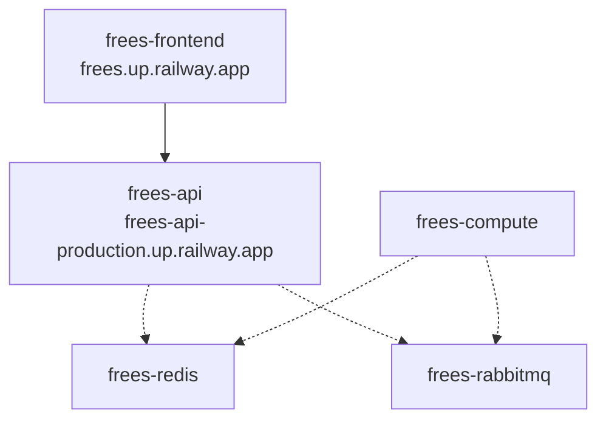

# frees

**free solver** — a web-based, open-source equation-solving environment for engineers.

Solves systems of non-linear simultaneous equations: ANTLR-parsed equations are decomposed into sequentially solvable blocks (bipartite matching + Tarjan SCC) and solved with Newton's method with step-halving, behind a Spring Boot REST API with a React/TypeScript front end.

## Features

- **Equations & Markdown Editor**: A custom-designed monospace text editor with line numbers, allowing you to write equations intermixed with standard Markdown notes.
- **Formatted Report View**: Automatically extracts and evaluates equations (including inline variables like `T1 = 100 [C]`), rendering them as beautiful LaTeX/KaTeX math blocks alongside standard Markdown text.
- **Embedded Interactive Plots**: Embed active property diagrams, psychrometric charts, or X-Y plots directly in formatted reports using the tag `[Graph="Diagram Name"] Caption [/Graph]`, featuring automatic figure numbering and interactive Plotly controls.
- **Inline Solution Tooltips**: Hover over variables in equations within the Formatted View to inspect their solved values and units dynamically.
- **REPL Terminal & Workspace**: A dockable, interactive console window (movable like the Editor and Variable Explorer) that evaluates one line at a time against the live workspace — a unit-aware calculator with history and Tab-completion. Query and assign variables, build matrices/ranges, solve a single unknown implicitly, run the full `CALL` library (with output lengths sized automatically so you can write bare output names), and use the embedded **Symja** CAS interactively (`Factor`, `Expand`, `Simplify`, `Together`, `Cancel`, `Collect`, `Diff`, `Integrate`, `Apart`, `Laplace`, `InverseLaplace`). A MATLAB-style variable explorer lists the workspace alongside it.
- **Robust Math Solver**: Decomposes systems of equations into blocks via bipartite matching + Tarjan SCC, solved with Newton's method and step-halving.
- **Matrix & Vector Algebra**: 2D matrix variables (`A[1,1] = 2; A[1,2] = 1` — multiple equations per line), array literals (`b[1..3] = [8, -11, -3]`), and linear-algebra operations (`SolveLinear`, `Inverse`, `Transpose`, `Determinant`, `Dot`, `Cross`, `Norm`, `LUDecompose`, `Eigenvalues`/`Eigen`, Euler rotations) that expand into scalar equations and solve alongside the rest of the system. Matrices render as grids in the Arrays window and as KaTeX block matrices in reports.
- **Control Systems & Symbolic CAS**: MATLAB-Control-Toolbox-style analysis as native equations — LTI models as plain arrays/matrices (TF `num`/`den`, state space `A,B,C,D`, ZPK), conversions (`tf2ss`, `ss2tf`, `zp2tf`, `tf2zp`), interconnection (`series`, `parallel`, `feedback`), poles/zeros and stability margins (`pole`, `zero`, `margin`), frequency response (`bode`, `nyquist`) and time response (`step`, `impulse`, `lsim`) with dedicated interactive plots, and state-feedback/PID design (`lqr`, `place`, `pidtune`). `CALL` output array lengths are inferred from the inputs, so outputs can be written as bare names. An embedded Symja CAS additionally solves **symbolic identities** — e.g. Laplace partial-fraction decomposition (`SYMBOLIC s`, `tf(...)`) whose residues become ordinary solved variables — and its symbolic transforms (`Factor`, `Apart`, `Laplace`, `InverseLaplace`, `Diff`, `Integrate`, …) are available interactively in the REPL terminal.
- **Thermodynamic Property Database**: Built-in support for fluid state lookups using CoolProp (and psychrometrics / humid air), overlaid onto interactive property diagrams.
- **Calculus, Complex & Special Functions**: Numerical integration of expressions and first-order ODEs (`Integral`), complex-number arithmetic, a broad special-function library (Bessel `J`/`I`/`Y`/`K` of all orders, error/gamma/beta functions), and statistical functions (Chi-Square CDF `chi_square(x, df)`, normal probability ranges `probability(x1, x2, mean, stdDev)`).
- **Uncertainty Propagation**: Propagates measurement/parameter uncertainties (specified as absolute or relative values in the Variable Information window, or defined via equations like `UncertaintyOf(X) = <expr>`) through implicit systems of simultaneous equations using numerical Jacobians and Singular Value Decomposition (SVD). Allows querying calculated uncertainties inside the model using the `UncertaintyOf(X)` accessor (e.g., `u_T = UncertaintyOf(T)`). Propagated uncertainties are displayed as `val ± unc` in the Solution window.
- **Optimization**: Single- and multi-variable minimization/maximization (Brent, Nelder–Mead Simplex, BOBYQA) with bound and constraint handling (log-barrier inequalities, augmented-Lagrangian equalities).
- **Graph Digitizer & Function Tables**: Trace data off a scanned chart and call the resulting curve as a function inside your equations, or define tabulated/interpolated functions.
- **Interactive Diagram Window & Live Dashboards**: A vector schematic editor whose labels, gauges, and embedded Plotly charts read live from the solver — with conditional formatting, animation/flow, parametric-table playback, recording, templates, and SVG/PNG/PDF export.
- **Whiteboard**: An [Excalidraw](https://excalidraw.com) freehand sketch canvas complementing the solver-bound Diagram window — hand-drawn shapes, text, and pasted images for quickly sketching out a problem. Each whiteboard is a managed dock window that round-trips with your project (saved into the `.frees` file) and exports to PNG/SVG.

## Quick start

```bash
./frees.sh start    # build and start both servers in Docker
```

Open <http://localhost:5173>, **Check** your equations, then **Solve**.

```bash
./frees.sh stop     # stop everything
```

## Development

```bash
cd backend && ./gradlew test        # backend tests
cd frontend && npm ci && npm run build   # frontend type-check + build
```

See [CLAUDE.md](CLAUDE.md) for the development workflow and [ARCHITECTURE_AND_REQUIREMENTS.md](ARCHITECTURE_AND_REQUIREMENTS.md) for the architecture and roadmap.

## Deployment

The app is deployed on [Railway](https://railway.app) as multiple services built from this repository's `main` branch.

### Architecture


> **Note on RabbitMQ**: One exception in the Railway architecture is that we cannot use a custom Dockerfile for RabbitMQ. Therefore, the `frees-rabbitmq` service was deployed directly by specifying the image source by hand rather than building from our source.

- **Frontend**: <https://frees.up.railway.app> (`frontend/Dockerfile`), calling the backend API directly via `VITE_API_BASE`.
- **Backend API**: <https://frees-api-production.up.railway.app> (`backend/Dockerfile`, Spring Boot).
- **Backend Compute**: Background worker node (`frees-compute`, `backend/Dockerfile`).
- **Redis**: state store (`frees-redis`).
- **RabbitMQ**: message broker (`frees-rabbitmq`).

Cross-origin access to the API is restricted to `http://localhost:5173` and `https://*.up.railway.app` by default; set `FREES_CORS_ALLOWED_ORIGINS` (comma-separated origin patterns) on the backend service to allow other origins.

The frontend bundle is stamped with the git commit it was built from. The **About** dialog shows that commit and links to it on GitHub, so you can confirm which revision a deployment is running — on Railway this comes from the built-in `RAILWAY_GIT_COMMIT_SHA`, and locally from `frees.sh` (`git rev-parse --short HEAD`). See `CLAUDE.md` → *Build stamping*.

## License

MIT
