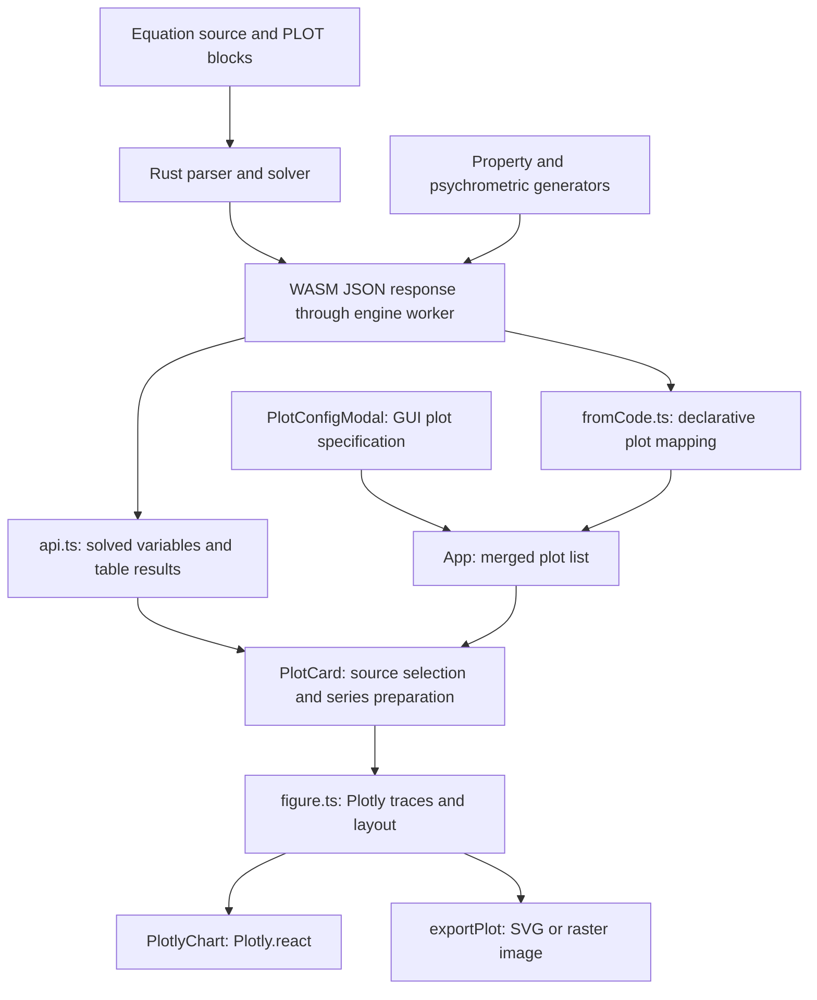

# Frees plotting engine: capabilities, comparison, and improvement plan

Date: 6 September 2026. Scope: the browser application in `frees-wasm`.

## 1. Assessment

Frees has a substantial scientific plotting foundation, but its plotting product is less mature than its solver. It already has eight plot kinds, six XY presentation types, thermodynamic state overlays, dual-Y plots, code declarations, and image export. The main problem is the consistency of the path from a solved result to a trustworthy, inspectable, reusable figure.

**Recommendation: retain Plotly and improve data binding, correctness, and interaction before expanding the chart catalog.** The first release should make existing plots reliable. The next should make them useful for engineering decisions through cursors, units, annotations, comparison, and better thermodynamic controls. Large-data optimization should follow representative browser measurements.

The highest-priority findings are:

1. Plots implicitly follow the active table rather than retaining a source identity.
2. Missing XY samples are removed, allowing lines to bridge unavailable results.
3. A newly configured histogram requires an X variable that its UI disables.
4. Solved-array 3D plots lose their Z data before reaching the renderer.
5. Every control plot unnecessarily requests a psychrometric chart.
6. Code-defined plots expose GUI actions whose changes are discarded.
7. Interaction state, units, and export behavior are inconsistent across plot kinds.

These are integration problems with concrete fixes; replacing the renderer would not resolve them.

## 2. Evidence and limitations

The initial inspected revision was `f25a312`. This was a live workspace with unrelated solver/documentation changes; this investigation did not modify those changes. File paths and symbol names below are the durable evidence references; line numbers may shift as concurrent work proceeds.

Methods:

- Traced plot declarations through the Rust parser, WASM/API boundary, React configuration, data preparation, figure construction, rendering, and export.
- Inspected the thermodynamic generators and the shared engine worker.
- Read official documentation for EES, OpenModelica, MATLAB/Simulink Simulation Data Inspector, Origin, Desmos, and Plotly. Sources were retrieved on 6 September 2026. These are documented feature comparisons, not hands-on comparative benchmarks or claims about competitors' undisclosed rendering internals.
- Ran the two existing plot-relevant frontend test files: **13 tests passed**.
- Ran four temporary diagnostic tests against current functions/hooks: **4 passed**, confirming the histogram gate, dropped XY gaps, missing array Z data, and spurious psychrometric request. These tests asserted the observed defects, not the desired behavior, and were removed after investigation.
- Measured an existing local production Plotly artifact: **1,723,457 raw bytes; 565,004 gzip bytes**. This was an existing `web/dist/assets/plotlyBundle-B8DV0bhV.js`, not a clean build of the reviewed source. It must not be treated as the current release size. Comments elsewhere claim different historical sizes.

Evidence labels used below:

- **Confirmed**: exercised in the targeted diagnostic checks.
- **Code finding**: directly follows from the inspected source; browser reproduction remains useful.
- **Hypothesis**: plausible performance or usability impact requiring measurement.
- **Proposal**: desired future behavior, not an existing capability.

No full browser interaction audit, screen-reader audit, production build, solver benchmark, or competitor timing comparison was performed. Latency targets in this report are proposed acceptance targets, not measured Frees performance. Unit tests use mocked API boundaries; they do not establish live thermodynamic numerical accuracy.

## 3. Current capabilities and architecture

### 3.1 Product context

Frees is a local-first engineering calculation and modeling application. Its Rust/WASM engine solves declarative equations, works in SI with dimensional checking, handles arrays and parametric calculations, integrates dynamic systems, expands acausal components, and supplies control-system and thermophysical calculations. The React application also contains fitting, optimization, Monte Carlo, table, and PID tools. These capabilities create richer plotting needs than a generic dashboard: discontinuities, uncertainty, units, operating envelopes, multiple runs, and physical state identity all matter.

The README describes 295 components across 13 physical domains; that is repository-reported context, not a recount performed here. The chart review does not claim to validate all solver features.

### 3.2 Data flow



Important boundaries:

| Layer | Current implementation | Consequence |
|---|---|---|
| Declaration | Rust `PlotAttributes` retains raw attribute lists; `fromCode.ts` interprets them | Syntax acceptance and supported plot semantics are separate |
| Model | `PlotSpec` contains XY, property, psychrometric, control, and format fields | One persisted GUI shape exists; extend it incrementally |
| Source | Every dock plot receives the same active table rows/results, plus global solved variables | A plot has variable names but no durable table/run binding |
| Preparation | `PlotCard.tsx` parses table strings or extracts solved array elements | Missing-data policy and array alignment are application responsibilities |
| Thermodynamic computation | `props/diagrams.rs` and `props/psychro.rs`, running in the shared worker | Computation avoids the UI thread but competes with solves in the same worker |
| Rendering | Partial Plotly bundle; `Plotly.react`, `ResizeObserver`, animation-frame resizing, purge on unmount | Lazy loading and dock resizing already exist |
| Export | Rebuilds the figure with light/dark theme and calls `Plotly.toImage` | Export is specification-based, not a capture of current user interaction state |

Source: [`types.ts`](../web/src/plots/types.ts), [`PlotCard.tsx`](../web/src/plots/PlotCard.tsx), [`PlotlyChart.tsx`](../web/src/plots/PlotlyChart.tsx), [`App.tsx`](../web/src/App.tsx), [`engineClient.ts`](../web/src/wasm/engineClient.ts).

### 3.3 Capability inventory

| Area | Present | Current boundary |
|---|---|---|
| XY | Line plus markers, scatter, bubble sizing, bar, pie, histogram, `surface3d` | `surface3d` is a triangulated `mesh3d`, not a gridded surface; array Z/size paths are incomplete |
| Sources | Active table rows/results and solved arrays | Heuristic fallback; no explicit per-plot source or saved-run selection |
| Axes | Labels, grid, linear/log scales, limits, ticks, font size | Shared format fields are not consistently honored by control/3D builders |
| Dual Y | Line, bar, scatter traces can use the right axis | Right axis is forced linear; no matching unit/range controls |
| Units | Thermodynamic display conversions including offsets; XY unit labels | General XY display-unit conversion is not implemented |
| Thermodynamics | T-s, P-h, P-v, T-v, h-s, P-T; saturation and isolines | Fixed generator sampling and automatic isoline choices |
| Psychrometrics | Pressure and temperature window, RH/saturation, wet-bulb, enthalpy, volume lines | Limited family controls; no point-to-state calculation workflow |
| State overlays | Detected states, declared circuit selection, connection/closure, solver cycle path | Global path is not filtered with selected circuit; labeling and direction controls are limited |
| Controls | Bode, Nyquist, Nichols, pole-zero, root locus | Accessible through code declarations; no equivalent control-data section in the GUI modal |
| Interaction | Plotly's default interaction configuration, dockable plot windows | No application-owned measurement cursors, linked plots, or source-row selection |
| Styling | Titles, colors, legend placement, dark display and light export | No reusable theme/template workflow or general per-trace line/marker controls |
| Export | SVG, PNG, JPG; raster at 1200×800 with 4× scale | Fixed size; current zoom/legend/camera edits are not explicitly captured |
| Persistence | GUI specs in project state; code specs regenerated | Code/GUI ownership and name collisions are not clearly surfaced |

Primary references: [`PlotConfigModal.tsx`](../web/src/plots/PlotConfigModal.tsx), [`figure.ts`](../web/src/plots/figure.ts), [`fromCode.ts`](../web/src/plots/fromCode.ts), [`units.ts`](../web/src/plots/units.ts), [`exportPlot.ts`](../web/src/plots/exportPlot.ts).

### 3.4 Preserve the parts that already work

Keep the worker boundary, lazy Plotly import, partial module registration, shared screen/export figure builders, ResizeObserver, and purge cleanup. Thermodynamic curves preserve unavailable values as `null`, which is the correct starting point for scientific integrity. Extend that discipline to XY and control data.

The removed Data Analyzer previously had cursors, comparison, and decimation. Its removal was deliberate, documented in [D11](decisions/0011-remove-analyzer.md). The proposed features belong in the existing Plots/Table workflow; restoring the old analyzer and its second plotting stack would contradict that simplification unless a new product decision explicitly justified it.

## 4. Comparison with similar applications

### 4.1 Why these applications

EES is the closest thermodynamics/equation-solving comparison. OpenModelica is relevant to acausal simulation results. MATLAB/Simulink offers a mature model-validation workflow. Origin provides a scientific publication benchmark. Desmos is useful specifically for graph exploration and accessibility. Plotly itself supplies the implementation baseline for capabilities Frees can expose without a renderer migration.

### 4.2 Comparison matrix

| Reference | Documented capability | Frees today | Improvement to adopt |
|---|---|---|---|
| EES | Table/array plotting, overlays, two X and two Y axes, text/shapes, crosshairs, plot duplication | Multiple Y series and dual Y exist; source identity and point inspection are weaker | Explicit source binding, point-to-table navigation, duplicate/style reuse |
| EES property plots | Crosshairs can show thermodynamic properties for the state under the pointer | Curve-coordinate hover and state overlays | Click-to-inspect physical state with fluid, units, and valid-domain feedback |
| OpenModelica OMEdit | Variable checkboxes, time and parametric plots, array plots, tiled windows | Docking and table-column plot creation already exist | Hierarchical variable browser, array-base selection, one-action plot against time |
| MATLAB Simulation Data Inspector | Multiple subplots, data cursors, saved views, run/signal comparison with absolute/relative/time tolerances | Current-result figures without a plot-level run-comparison model | Pin baseline run, overlay candidate, aligned cursors, explicit difference/tolerance view |
| Origin | Templates, multiple axes/panels, error bars, contour/heatmap and scientific chart types | Basic formatting and image export | Uncertainty display, templates, 2D engineering maps, export preview |
| Desmos | Keyboard graph navigation and audio trace | Labeled form controls, but chart wrapper has no application-owned accessible exploration model | Keyboard probe and data-table alternative first; sonification only with demonstrated demand |

Official sources: [EES Plot Windows](https://fchart.com/ees/eeshelp/4qz0_jh.htm), [OMEdit plotting](https://openmodelica.org/doc/OpenModelicaUsersGuide/latest/omedit.html#d-plotting), [Simulation Data Inspector](https://www.mathworks.com/help/simulink/slref/simulationdatainspector.html), [Origin Graphing](https://www.originlab.com/index.aspx?go=products/origin/graphing), [Desmos keyboard shortcuts](https://www.desmos.com/shortcuts), [Desmos Audio Trace](https://help.desmos.com/hc/en-us/articles/37064105800333-Audio-Trace).

EES documents some point-to-table inspection as a Professional-license feature. This is a workflow reference, not an assertion that all editions provide identical functions. No relative performance ranking is supported by this research.

### 4.3 What the comparison means

The largest practical gap is **inspection and reproducibility**, not the number of shapes that can be drawn. Frees should let an engineer answer: Which run and table produced this curve? What happened at this point? Did the new model improve the result? Are gaps failures or simply unmeasured samples? Will the exported figure reproduce what I inspected?

Use the existing dock layout for multi-panel work. Use existing table selection and solver metadata for provenance. Keep advanced controls contextual. There is no need to imitate the full desktop menus of these products.

## 5. Correctness and integration findings

Priority definitions: **P0** means misleading data or broken existing workflow; **P1** means substantial daily-use limitation; **P2** means a later expansion. They indicate implementation order, not a security severity scale.

### F1 — Source identity is implicit (P0, code finding)

`App.tsx` passes `paramRows`, `tableResults`, and `activeParam?.columnUnits` to every plot. `XYConfig` stores variable names but no table ID. `buildXyFigureFromSpec` decides between table rows and solved arrays using row/result availability and whether any requested Y value is present.

**Trigger:** create a plot from table A, then activate table B containing the same column names. The plot consumes B's data without an explicit rebind. If names do not match, it can become empty instead. The current check does not require the X data to be available before choosing table mode.

**Fix:** store an explicit source reference at creation: table ID or solved arrays. Show it in the plot header/inspector. Add a result revision when saved runs are introduced. Missing/deleted sources should produce an actionable message, never silently substitute another source. Existing projects need an explicit legacy migration policy; bind to their saved active table only when it can be identified unambiguously.

**Acceptance:** changing the active table does not change an existing plot's source. Deleting its source leaves a clear “Choose source” state.

### F2 — Missing XY data disappears instead of creating a gap (P0, confirmed)

`buildXYSeries` pushes a point only when required values exist; `buildArrayXYSeries` likewise retains only common indices. A diagnostic with `(1,10), (2,missing), (3,30)` returned X `[1,3]`, Y `[10,30]`. The default line renderer then has no missing point at which to break the line.

`runValue` also falls back to typed row values when a result is unsuccessful. That fallback is useful for raw input tables but must not make failed simulation output look solved.

**Fix:** retain index/row identity and explicit gaps for ordered lines. Distinguish input-only rows, unsolved rows, and failed solves. Do not bridge unavailable solver output by default. Scatter/histogram filtering can differ, but must show a valid/skipped count. Preserve traversal order for cyclic XY paths; sorting every plot by X would be a new error.

**Acceptance:** the three-point example draws two separated samples; failed rows are identifiable; cursor/export can recover original row IDs.

### F3 — Fresh histogram configuration cannot produce a figure (P0, confirmed)

The modal disables the X selector for histograms, while `buildFigure` requires `spec.xy.xVar` for all XY types. A new spec with histogram type, selected Y, and null X returns `null`. The histogram builder itself uses Y samples, so requiring X is unnecessary. A histogram converted from an existing XY plot may work because it retains X.

**Fix:** make required channels chart-specific in both validation and preparation. Histogram requires a sample channel; 3D requires X/Y/Z; bubble size is optional. Add bin count/width and normalization after the basic path works.

**Acceptance:** creating a histogram from one selected numeric column works without an X selection or hidden retained state.

### F4 — Array-based 3D and bubble data are incomplete (P0/P1, confirmed for 3D)

`buildArrayXYSeries` accepts X and Y only. The table path passes Z and size, but the array path does not. The diagnostic supplied X/Y/Z arrays for `surface3d` and obtained a figure with zero traces. Bubble size has the same structural omission.

**Fix:** align all selected channels by their original indices. Require Z for mesh plots and validate size values. Distinguish “triangulated surface” from a true grid surface. Reject or explain insufficient/degenerate geometry rather than showing a successful empty figure.

**Acceptance:** equivalent table and array data produce equivalent coordinates and marker sizes; incomplete arrays cannot silently mispair channels.

### F5 — Control plots compute psychrometric curves (P0, confirmed)

`useDiagramData` returns early only for `xy`. Its request branch handles `property`, then sends every remaining kind to `getPsychrometricChart`. A Bode hook invocation called that API in the diagnostic.

**Impact:** unnecessary worker work and misleading “Computing property curves…” UI; unrelated psychrometric failures can appear on control plots. The actual compute cost was not measured.

**Fix:** restrict the effect to `property` and `psychro`, with kind-specific dependencies. Do not fetch fluids for every non-thermodynamic plot window either.

**Acceptance:** opening each control kind sends zero property/psychrometric requests.

### F6 — Code plot ownership is inconsistent (P0, code finding)

`PlotTab` exposes Configure and Remove for code plots. `App.handlePlotsChange` strips all `fromCode` entries, then `mergedPlots` derives them again from source. A GUI edit is therefore discarded, and removing a code plot from its card does not remove its declaration. A GUI plot with the same case-insensitive name suppresses the code plot.

**Fix:** visibly badge “Defined in code”; provide “Edit declaration” and “Duplicate as editable plot.” Disable misleading Apply/Remove paths or implement an explicit override model. Prefer source navigation and duplication initially. Validate duplicate names because names also form code plot IDs.

**Acceptance:** every visible action has a durable effect; collisions produce feedback; saving/reopening preserves the documented ownership rule.

### F7 — Declarative syntax accepts more than the mapper honors (P1, code finding)

The parser validates array slice syntax but drops the slice indices (`plot_array_index` and its comments explicitly preserve upstream behavior). Thus a declaration resembling `x[2:5]` does not retain that selection. `fromCode.ts` silently defaults unknown kinds to XY and unknown chart types to line; invalid booleans become false. Several GUI fields, including display units and state-table selection, are not mapped from code.

**Fix:** validate supported attributes and values with source diagnostics. Document the current whole-array behavior immediately. Preserve slices only through a deliberate compatibility change with new tests; do not alter frozen oracle fixtures casually. Introduce code/GUI field parity only for supported options.

**Acceptance:** unknown kinds/attributes and unsupported slices cannot silently produce a different chart than requested.

### F8 — Units and axis controls need consistent semantics (P1, code finding)

Thermodynamic axes transform values; XY only annotates labels. A shared Y unit is inferred by ignoring empty units, so a known-unit series combined with an unknown-unit series can inherit an unjustified axis label. The right axis is always linear. Control builders bypass much of `axisLayout`, so generic bounds/ticks/log controls can have no effect. Some control/3D axis titles use strings while other builders use title objects; check against the installed Plotly v3 schema rather than trusting the permissive local type shim.

`rangeValue` clamps nonpositive logarithmic bounds to `1e-20`; that conceals invalid input. Celsius and gauge pressure can also create nonpositive displayed values on logarithmic axes.

**Fix:** centralize validation for applicable controls, preserve SI storage, and convert only at presentation. For mixed dimensions offer separate axes/panels with an explanation. Unknown units must stay unknown. Explain log tick spacing and reject incompatible bounds/offset-unit combinations. Hide unsupported controls until implemented.

**Acceptance:** on-screen values, hover, cursor, and export agree on units; invalid ranges have field-level errors; all exposed controls change the relevant plot.

### F9 — Thermodynamic overlay and marker integrity (P1, code finding)

The API carries diagram `markers`, including the critical point, but `buildPropertyFigure` does not render that collection. Circuit selection filters state points, while the same global `cyclePath` is passed to `connectionTrace`, which prefers it whenever present. Selecting a circuit therefore does not establish that the connected path belongs to it. A missing selected state table falls back to all detected states.

**Fix:** render backend markers; bind paths to a circuit/fluid or suppress an ambiguous path with explanation. Do not silently fall back to all circuits. Label straight state connections as schematic connections, not a computed process path. Add direction arrows and selectable state labels.

**Acceptance:** a two-fluid model never overlays another circuit's path by accident; critical markers and incomplete paths are explicit.

### F10 — Interaction state and export diverge (P1, code finding)

There is no `uirevision`, stable trace `uid`, or application relayout/selection state in the current chart wrapper. Figure rebuilds can reset user interactions. Export reconstructs from `PlotSpec`, so transient zoom, hidden legend traces, and camera changes are not explicitly preserved.

**Fix:** define “keep view” versus “fit data” behavior and stable trace identity. Use Plotly's existing persistence controls; reset on source/unit changes where retaining the range would be misleading. Offer export of “Current view” and “Full data view.” [Plotly documents `uirevision` for preserving interactions](https://plotly.com/javascript/uirevision/).

**Acceptance:** a solve refresh preserves an intentional zoom when the source and units are unchanged; current-view export matches the inspected view.

### F11 — Rendering failures need a visible boundary (P1, code finding)

`PlotlyChart` starts asynchronous imports and rendering without catching rejection. It guards cancellation before `Plotly.react`, but not the entire asynchronous lifecycle. Multiple updates or unmount during rendering deserve a focused browser test. React error boundaries do not by themselves handle rejected asynchronous promises.

**Fix:** surface load/render failures and offer Retry; sequence updates if the stress test demonstrates a race. Keep the existing purge/resize cleanup. Handle WebGL context loss for 3D without erasing the user's configuration.

### F12 — Help and report capabilities are not aligned (P1, code finding)

`web/src/docs/diagrams_plots.md` promises live `[Graph=...]` rendering in a Formatted view. The current `report.ts` generates a calculation report with source, variables, and warnings, and does not accept figures. Searches of current TS/TSX found no corresponding graph-embedding renderer.

**Fix:** reconcile help with current functionality, then add an explicit “Include selected plots” report path if wanted. Reuse image export rather than building a second chart renderer. Treat the documentation claim as unverified/unsupported in this checkout, not as a shipped plotting strength.

## 6. Capability improvements worth adding

### 6.1 Measurement and engineering interpretation (P1)

Add one persistent cursor first, then a two-cursor measurement panel showing X/Y, ΔX, ΔY, and slope with units. Use original samples and source row identity, even when the visible trace is reduced. Add point-to-table selection and a keyboard-accessible sample list. Plotly exposes click, hover, selection, and relayout events; the application needs to supply the meaning and persistence. [Plotly event reference](https://plotly.com/javascript/plotlyjs-events/).

For time responses, allow step/hold interpolation explicitly; connecting discrete controls with sloping lines can imply nonexistent intermediate values. Add threshold lines and a small set of annotations: text, arrow, horizontal/vertical reference, and shaded interval. Reuse Plotly shapes/annotations; do not build a drawing application.

### 6.2 Comparison and uncertainty (P1 after source binding)

Start with “Pin this result as baseline” and “Compare with latest.” Preserve the minimal source metadata: model revision, solve settings, relevant input values, time, units, and result identity. Overlay and difference views should clearly state sample alignment and interpolation, especially for adaptive time grids and discontinuities.

Add error bars or bands from existing uncertainty/fitting/Monte Carlo outputs where their statistical meaning is known. Label standard deviation, confidence interval, and min/max separately. Do not invent confidence bounds from a single scalar uncertainty or calculate statistics on decimated rendering points.

Full run archives, arbitrary comparison pipelines, and tolerance alignment engines can wait until the two-run workflow is used enough to justify them.

### 6.3 Thermodynamic plotting (P1/P2)

Expose isoline families separately, with optional values/count and inline labels. Keep a simple automatic default. Add visible state labels, flow direction, critical point, domain/gap summaries, and click-to-inspect state properties. Evaluate a selected point on click initially; continuous pointer-driven flashes would create unnecessary worker traffic.

Viewport-specific or adaptive curve generation is a later accuracy/performance improvement. It must retain phase boundaries and invalid gaps. Keep generation metadata separate from display units so choosing kPa instead of Pa never recomputes the thermodynamic background.

### 6.4 Controls and multidimensional results (P1/P2)

Expose the existing five control kinds through presets populated from solver outputs. Add optional stability margins and crossover markers only when computed with an appropriate numerical method; approximate values from sparse displayed samples must be identified as estimates. Root locus should carry gain alongside coordinates for inspection.

For parameter sweeps, a heatmap/contour is usually more readable than a rotatable 3D mesh. Add those for two independent inputs and one response after channel binding is fixed. Require a rectangular grid or an explicit interpolation choice. Later offer a true `surface` trace alongside the existing triangulated mesh. Plotly distinguishes these trace models. [Plotly surface reference](https://plotly.com/javascript/reference/surface/).

Do not prioritize financial charts, maps, arbitrary dashboards, or more pie variants: they have weaker connections to Frees' engineering workflows.

## 7. Performance improvement plan

### 7.1 Existing strengths and actual risks

The compute engine already runs off the UI thread. Plotly is already lazy-loaded and updated with `react`; replacing that with repeated `newPlot` would regress lifecycle behavior. Plotly documents efficient figure updates and the need for immutable data identity or a changed data revision. [Plotly function reference](https://plotly.com/javascript/plotlyjs-function-reference/).

| Opportunity | Evidence | First intervention | Measurement required |
|---|---|---|---|
| Unnecessary control computation | F5 confirmed | Gate diagram requests by kind | Request count should become zero |
| Duplicate thermo work | No diagram-response cache in API/hook; each mount requests curves | Bounded shared result/in-flight cache | Cold vs repeated chart time, call count, memory |
| Rebuilding unchanged figures | `PlotTab` calls `detectStates` on every render, creating fresh input identity | Memoize detection by solved result; keep unchanged inputs stable | Figure-builder/render count during unrelated UI actions |
| Repeated array scans | Each selected series scans the flat variable list | Index requested array channels once per result revision | Preparation time versus variables/traces |
| Large marker sets | Default lines use `lines+markers`; all 2D traces use SVG scatter | Suppress dense markers, then evaluate render-only reduction | Pan/zoom latency and visual extrema preservation |
| Bubble-size overflow | `Math.min(...values)`/`Math.max(...values)` spread every element into arguments | Single-pass min/max | Large-array check avoids engine argument-count limits |
| Serialization/copies | WASM returns JSON; client parses on main thread; table values are strings parsed for charts | Profile each boundary before changing transport | Parse time, allocation and retained heap |
| 3D affects first 2D chart | Shared partial bundle statically imports `mesh3d` | Measure optional 3D registration split | 2D cold-open transfer/parse time and offline behavior |
| Invisible plots | Dock windows may retain mounted content | Verify visibility lifecycle, then defer invisible updates | Work with 1/4/12 open plots and 1 visible |
| Image export memory | Default 4800×3200 raster output | Offer output-size presets and serialize export jobs | Peak memory and export duration |

The raster dimensions imply **61,440,000 bytes (~58.6 MiB)** for one RGBA image buffer alone; browsers may allocate additional buffers. This is arithmetic, not a measured heap peak.

### 7.2 Caching must respect numerical behavior

Cache completed diagram responses rather than widening the low-level thermophysical cache. `propfun.rs` documents why its one-slot cache preserves seed-sensitive backend behavior and why larger variants were rejected. A plotting optimization must not undo that work.

A candidate chart cache key includes canonical fluid, diagram kind, engine/backend revision, and all numerical generation settings; psychrometric keys include pressure and temperature window. Exclude colors, overlay states, and display units. Bound entries/bytes, share in-flight requests, and evict rejected promises so Retry works.

**Important validation:** skipping chart computation also changes the shared worker's property-call history. Check subsequent solver results against the project's tolerance/parity rules before treating a diagram cache as numerically neutral. Compare cold computation, repeated cached access, then solving the same document. Do not promise bit identity without evidence.

### 7.3 Large-data rendering strategy

1. Measure raw SVG with representative curves.
2. Remove unnecessary markers on dense line traces.
3. For monotonic time series, use viewport/pixel-aware min/max reduction that retains extrema, endpoints, and gap boundaries.
4. Keep raw data for cursor lookup, statistics, export, and comparison; show when the display is reduced.
5. Evaluate lazy `scattergl` only if SVG remains inadequate. Do not blindly decimate unordered scatter or cyclic XY paths with a time-series algorithm.

Plotly documents WebGL as an option for larger datasets, but browsers limit active contexts and a figure can use more than one. It is therefore unsuitable as an unconditional default for many dock windows. [Plotly WebGL/SVG guidance](https://plotly.com/javascript/webgl-vs-svg/).

Separate the numerical output sampling of an integrator from render reduction. Reducing solver output can remove events and alter downstream analysis; reducing a display should not alter the engineering result.

### 7.4 Worker and transport decisions

First eliminate spurious and duplicate requests. Stale-response suppression currently prevents React state updates but does not cancel synchronous WASM work already executing. The shared worker also means a long solve can delay a property chart and vice versa.

If contention remains measured and material, consider cooperative cancellation or a dedicated property worker. A second worker duplicates WASM memory and backend state; it is not a free optimization. Typed-array transfer is similarly a later change justified by measured JSON/allocations, not a default rewrite of every API.

### 7.5 Bundle and offline behavior

Measure a clean production build before setting a new bundle budget. The existing artifact measured in this review and the historical comments disagree, so neither establishes the current bundle graph.

Splitting 3D may improve first-use parsing/loading for 2D. However, `vite.config.ts` precaches the entire app for offline operation, including lazy chunks. Splitting alone does **not** reduce total offline-install bytes. Confirm both the initial online experience and first offline 3D plot after any bundling change.

## 8. UI/UX proposal

### 8.1 Creation and editing

Keep the existing table-column “plot” action and make it the fast path. Capture source identity when it opens the modal. Default time-series X to time when appropriate; arrays can offer index explicitly. Start the modal with source and channels, not all formatting options.

Use three compact sections in the existing Inspector or modal:

| Section | Contents |
|---|---|
| Data | Source/table/run, X/Y/Z/size, valid-point count, data status |
| Axes and traces | Units, scale, range, interpolation, line/marker style |
| Presentation | Title, legend, annotation, export appearance |

Offer a small preview or immediate reversible application. Keep uncommon options collapsed. Validate required channels and ranges inline before Apply. A histogram should never show an irrelevant disabled X field as its primary input.

A proposed plot header reads: `Pump response · Table: sweep A · Latest successful run`, with actions for Inspect, Fit data, Configure, and Export. Use named buttons or accessible labels rather than relying on unfamiliar modebar icons alone.

### 8.2 State and feedback

Distinguish these states rather than returning a generic “No data yet”:

- Source not chosen → Choose source.
- Source exists but is unsolved → Solve this table/model.
- Source removed → Rebind source.
- Some rows failed → Show valid/failed counts and open failed rows.
- No valid points for the selected scale → Explain missing or nonpositive data.
- Recomputing → Keep the previous chart visibly marked as stale.
- Render failure → Retry while retaining configuration.

Show stale result identity after source edits. Associate errors with the operation that failed; a control chart should never report a humidity-chart error.

### 8.3 Inspection and accessibility

Provide visible focus, keyboard-operable cursors, readable default text, and trace distinction through dash/marker as well as color. Add a chart description and an accessible table of selected/visible samples, with a path to all raw data. Do not assume the Plotly canvas/SVG or a virtualized grid alone provides a complete accessible experience.

Test narrow dock panels and a 360-pixel-wide viewport: legends, long unit labels, dual axes, and modebar controls need to remain reachable. Collapse the inspector into a drawer where needed. Touch users need explicit pan/zoom controls and an easy Fit data action. Keep rendering work tied to the visible plot, subject to measured dock behavior.

Audio tracing is a useful Desmos reference but is a later capability. Keyboard inspection and text/data alternatives are the immediate requirements.

### 8.4 Publication and reproducibility

Offer Small/report, Presentation, and Custom export sizes, aspect ratio, white/transparent background, and current/full view. Persist intentional styles and annotations. Include optional source/run information and a caption; allow CSV export of the exact source data through existing table/export utilities where possible.

Do not label all SVG exports as fully vector: mesh3d and other WebGL content can be rasterized inside SVG. [Plotly static-export documentation](https://plotly.com/javascript/static-image-export/) explains that limitation. Frees' PDF/EPS removal was deliberate; browser print-to-PDF and SVG are preferable initial paths to adding a server transcoder.

## 9. Implementation sequence and acceptance gates

Effort is relative: **S** = localized change; **M** = several frontend boundaries and tests; **L** = data/persistence or numerical work. These are scope estimates, not calendar commitments.

| Phase | Deliverable | Effort | Gate |
|---|---|---|---|
| 1A: correctness | F2–F5: gap policy, histogram requirements, array Z/size, request gating | M | Regressions exercise every source/type combination affected |
| 1B: source and ownership | F1/F6/F7: source binding, code ownership, validation, migration | M–L | Source stays stable across table switches and project reopen |
| 1C: consistent presentation | F8–F12: applicable axes, overlay identity, markers, keep-view, errors, accurate help | M | Controls work, no silent fallbacks, export semantics are explicit |
| 2A: daily engineering use | Cursors, row linking, line/marker styles, references, accessible data | M | Complete a sample-inspection task with mouse and keyboard |
| 2B: performance | Instrumentation, stable inputs, bounded diagram reuse, optional marker/reduction policy | M | Meets agreed workload targets without losing extrema/gaps or changing solver validity |
| 3A: comparison/publication | Pin baseline, overlay/difference, uncertainty, templates, export preview | L | Reopen a comparison and reproduce its data, units, and view |
| 3B: domain expansion | GUI control presets, isoline controls, engineering heatmaps/contours | M–L | Domain-specific numerical and interaction tests pass |

Minimal first shippable scope: fix F2–F5, make code-owned actions honest, and prevent silent source changes. Do not wait for heatmaps, adaptive sampling, or run archives to deliver those corrections.

### Suggested code ownership

- `PlotCard.tsx`: required-channel handling, gap policy, array alignment, kind-specific requests.
- `types.ts`, `App.tsx`, project loading: explicit source identity and migration.
- `fromCode.ts`, parser diagnostics: declaration validation and ownership semantics.
- `figure.ts`, `units.ts`, `plotly-dist.d.ts`: consistent units/layout, markers, trace identity, capability typing.
- `PlotlyChart.tsx`: interaction events, view persistence, error handling, lifecycle validation.
- `PlotConfigModal.tsx`, existing Inspector: contextual controls and errors.
- `api.ts`/client: bounded diagram reuse only after backend-sequence validation.
- `exportPlot.ts`, `report.ts`: current/full view, dimensions, selected plot inclusion.

No renderer abstraction layer, new state manager, or general-purpose chart plugin framework is needed for these steps. Expand the current interfaces only where a shipped capability needs them.

## 10. Benchmark and validation protocol

### Workloads

| Workload | Purpose |
|---|---|
| 1k samples × 3 time traces | Everyday reference |
| 10k and 100k samples × 8 traces, with spikes/gaps/events | Dense transient plots and reduction correctness |
| 1 million samples × 1 trace | Stress characterization, not an unconditional supported-size promise |
| 1, 4, and 12 dock plots, varying visibility | Render churn, memory, context limits |
| Water/R134a/CO2 property charts; repeated identical requests | Cold generation, cache reuse, critical-region behavior |
| Psychrometric charts at several pressures/windows | Validation and family generation costs |
| Bode/Nichols/root-locus arrays including missing indices | Alignment, unnecessary requests, grid costs |
| 3D table/array equivalents and high-resolution export | Geometry, context failure, export memory |
| Switch tables, edit source, reopen project, change units | Provenance and state persistence |

Record browser/version, machine, device pixel ratio, viewport, trace count, visible points, raw points, engine build, and cold/warm cache state. Use a release build, a normal laptop, and a constrained/mobile device. Report median and p95, with separate worker compute, JSON parse, preparation, and render times. Include main-thread long tasks and memory after repeated open/close cycles. A before/after comparison must use the same dataset and conditions.

### Proposed initial targets

These targets need agreement after baseline measurement:

- Cached, already-loaded everyday plot: p95 under 200 ms from data availability to usable render.
- Cursor feedback: p95 under 50 ms on the everyday workload.
- Dense pan/zoom: aim for at least 30 fps on the agreed reference device after any reduction.
- Unrelated UI action: zero figure rebuilds for unchanged plots.
- Identical concurrent diagram requests: one numerical generation.
- Control plots: zero thermodynamic requests.
- Source/unit correctness, gaps, and raw-data export: no tolerated regression.
- Repeated close/open: no sustained retained-heap/context growth after warm-up; do not assert exact garbage-collection timing.

### Regression coverage to leave with implementation

Use the repository's existing Vitest and Playwright infrastructure; no new test framework is warranted. Cover the repaired source/type matrix, gap preservation, index alignment, invalid logs, mixed units, code-owned actions, circuit path selection, and migration. Add a small browser scenario for zoom → re-solve → export, dock resize, and unmount during render. Test a failed dynamic import and WebGL context loss where supported.

For thermo cache/sampling changes, use existing numerical parity expectations and add focused curve/domain checks. Any intentional divergence from upstream behavior must be documented. Existing plot DTO tests alone are insufficient: this investigation found four integration failures while those tests stayed green.

## 11. Reproduction notes

Existing checks run with Node 22.23.2:

```sh
cd web
npm test -- src/api.plots.test.ts src/api.components.test.ts
```

Result: 2 files, 13 tests passed. The environment's default Node was 20, so this review explicitly selected the installed Node 22 executable for the run.

Temporary diagnostics used `newPlotSpec`, `buildFigure`, and `renderHook(useDiagramData)`:

| Diagnostic input | Observed result |
|---|---|
| New XY spec; type histogram; Y=`v`; X=null | `buildFigure` returns null |
| Table X/Y rows `1/10`, `2/blank`, `3/30` | Trace contains `[1,3]` and `[10,30]`, no gap |
| Solved arrays `x[1]`, `y[1]`, `z[1]`; type surface3d | Figure data is empty because Z never reaches builder |
| Bode spec passed to `useDiagramData`; psychrometric API mocked | Psychrometric API called once |

The 3D diagnostic establishes missing channel propagation before rendering; it does not claim a one-point mesh would be geometrically valid. Implementation tests should use a nondegenerate multi-point dataset as well.

## 12. Source index

Local sources:

- [Plot model](../web/src/plots/types.ts), [configuration](../web/src/plots/PlotConfigModal.tsx), [code mapping](../web/src/plots/fromCode.ts).
- [Source preparation and data hook](../web/src/plots/PlotCard.tsx), [plot window](../web/src/PlotTab.tsx), [application binding/persistence](../web/src/App.tsx).
- [Figure construction](../web/src/plots/figure.ts), [render wrapper](../web/src/plots/PlotlyChart.tsx), [bundle](../web/src/plots/plotlyBundle.ts), [local Plotly types](../web/src/plotly-dist.d.ts).
- [Units](../web/src/plots/units.ts), [state detection](../web/src/plots/stateTable.ts), [exports](../web/src/plots/exportPlot.ts), [calculation report](../web/src/report.ts).
- [Plot API](../web/src/api.ts), [worker client](../web/src/wasm/engineClient.ts), [worker dispatch](../web/src/wasm/engine.worker.ts), [WASM exports](../crates/frees/src/lib.rs).
- [Property curves](../crates/frees-core/src/props/diagrams.rs), [psychrometric curves](../crates/frees-core/src/props/psychro.rs), [backend cache constraints](../crates/frees-core/src/props/propfun.rs).
- [Parser blocks](../crates/frees-core/src/parser/blocks.rs), [plot parsing/slices](../crates/frees-core/src/parser/toplevel.rs), [plot help](../web/src/docs/diagrams_plots.md).
- [DTO tests](../web/src/api.plots.test.ts), [component/cycle tests](../web/src/api.components.test.ts), [offline/bundle configuration](../web/vite.config.ts), [D11 analyzer removal](decisions/0011-remove-analyzer.md).

External primary sources are linked beside the comparison and technical claims throughout the report. Product documentation establishes available workflows; it does not establish Frees performance or validate a proposed implementation.
