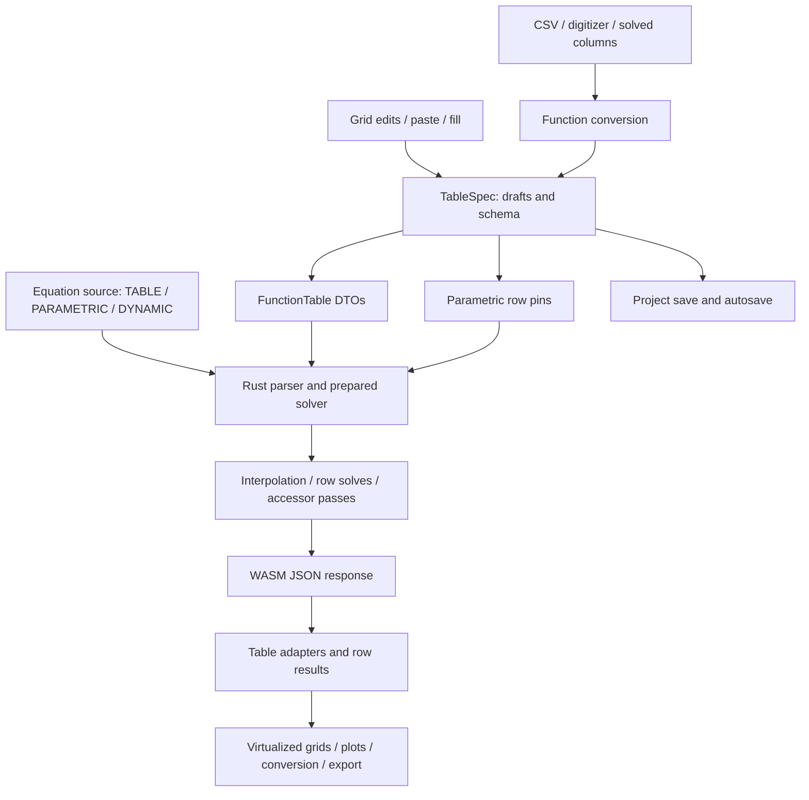

# Frees table engine: capabilities, comparison, and improvement plan

Date: 6 September 2026. Scope: `frees-wasm`, inspected from revision `33ea6db`.

Companion: [Plot engine review](plot-engine-review-2026-09-06.md).

## 1. Assessment

Frees has a capable engineering table foundation: virtualized editable/read-only grids, parametric sweeps, callable lookup functions, curve families, CSV import/export, interpolation, table accessors, and thermodynamic state tables. It is intentionally a purpose-built engineering workbook, not a general spreadsheet.

**Recommendation: keep Glide Data Grid and the existing table model, while fixing numerical fidelity, edit transactions, result provenance, and import transparency.** The most valuable additions are unit-aware columns, row diagnostics, dependable undo, controlled data conversion, and selected-run workflows. A new spreadsheet engine would add cost without fixing these issues.

The most consequential findings are:

1. Six-significant-digit formatting changes reusable numeric data and can merge distinct lookup-table knots.
2. Accessor-sweep convergence information exists in the core but is discarded at the browser boundary.
3. Table edits do not consistently advance the revision used to reject stale asynchronous results.
4. Undo restores whole snapshots, including unrelated metadata and old results.
5. Bulk edits can treat an unchanged computed cell differently depending on its position in the batch.
6. Import and conversion automatically sort, deduplicate, and reduce data; these operations can change the numerical function used by the solver.
7. Unit metadata and validation are weaker at the table interfaces than inside the solver.

Fix those before pursuing pivots, arbitrary formulas, or additional chart-style table decorations.

## 2. Scope, evidence, and limitations

This investigation followed the same method as the plot review:

- Read the table models, grid event handlers, CSV parser, composition dialogs, code/ODE adapters, application check/solve orchestration, persistence, WASM boundary, and Rust interpolation/sweep code.
- Reviewed D10 and D11 so recommendations account for deliberate spreadsheet/analyzer removals.
- Compared official documentation for EES, Origin, MATLAB, and Excel Power Query. Glide documentation and installed type definitions were checked for reusable grid capabilities.
- Ran existing frontend tests and temporary diagnostic checks. A small conversion microbenchmark examined preparation cost independently of painting.
- Inspected state tables as a related workflow; the primary focus is the editable workbook, lookup functions, parametric runs, and derived result tables.

Evidence terminology:

| Label | Meaning |
|---|---|
| Confirmed | A targeted executable check reproduced the reported behavior |
| Code finding | Directly supported by the inspected implementation; complete browser reproduction remains a useful implementation gate |
| Hypothesis | Expected performance/usability effect that needs measurement |
| Proposal | Future functionality, not an existing feature |

The investigation did not change product behavior. Temporary diagnostics asserted current behavior and were removed afterward; they are not regression tests that endorse the defects. The companion plot report was left intact.

This is not a full browser usability or accessibility audit. No competitor binaries were benchmarked, and no clean production bundle build was performed. External documentation establishes workflows, not competitors' undisclosed internals or relative speed. Dates refer to retrieval on 6 September 2026, not a claim that every referenced feature was newly released then.

## 3. Architecture and capabilities

### 3.1 There are several table systems, with different purposes

| Table class | Data owner | Main behavior | View |
|---|---|---|---|
| GUI parametric | Project `ParamTableSpec` | Nonblank cells pin inputs; blank cells are solved per row | Editable Tables workbook |
| GUI function/lookup | Project `FunctionTableSpec` | One-dimensional interpolation or a parameterized family callable from equations | Editable Tables workbook |
| Code `TABLE` | Equation source | Lookup definitions parsed by Rust | Read-only function table in workbook |
| Code `PARAMETRIC` | Equation source plus run results | Declared sweep inputs, solved outputs | Separate read-only dock window |
| ODE/DYNAMIC | Solver response | Sampled trajectory, not editable input data | Separate read-only dock window |
| State table | Solved properties and optional `STATE TABLE` declaration | Fluid-aware property display, missing-property resolution, plot overlays | Mantine HTML table with unit selectors |

These should share selection, numeric formatting, diagnostics, and provenance conventions without being forced into identical editing semantics. A trajectory is not automatically a parametric input sheet, and a lookup function is not an unordered measurement table.

Sources: [`tables.ts`](../web/src/tables.ts), [`tablesWorkbookBridge.ts`](../web/src/tablesGrid/tablesWorkbookBridge.ts), [`TablesTab.tsx`](../web/src/TablesTab.tsx), [`StatesTab.tsx`](../web/src/StatesTab.tsx).

### 3.2 Data flow



The workbook uses `TableSpec` as its only document. Edits update a synchronous ref and React state; `flushTablesWorkbook` hands current committed values to a solve before React necessarily rerenders. This is a useful existing contract, not a missing feature.

The core already uses `PreparedDocument` in the GUI sweep boundary, allowing reusable preparation across row solves. Accessor sweeps have a table-wide iterative process with a maximum of 12 passes. Do not recommend “parse once” or arbitrary row parallelism as though neither reuse nor dependency semantics exists.

Sources: [`TablesGridTab.tsx`](../web/src/tablesGrid/TablesGridTab.tsx), [`analysis.rs`](../crates/frees/src/analysis.rs), [`parametric.rs`](../crates/frees-core/src/analysis/parametric.rs), [`engine.rs`](../crates/frees-core/src/engine.rs).

### 3.3 Inventory

| Area | Already available | Boundary/gap |
|---|---|---|
| Grid | Canvas virtualization, selection/copy, column resizing, editable overlays, fill handle | View virtualization does not bound import, conversion, selection, undo, or serialization cost |
| Input/result distinction | Draft values take precedence; successful computed values shown green; failed Run marker | Status relies heavily on color; no explicit row error-detail interaction in workbook |
| Editing | Cell edits, bounded paste, clearing, append/remove last row, fill-column dialog | No general insert/delete selected rows; undo scope is inconsistent |
| Undo | Up to 100 snapshot entries; multi-cell edits form one user step | Metadata/external edits are not safely reconciled with snapshots |
| Parametric runs | Per-row inputs, individual failures, aggregate statistics, progress, deadline | Full-table request; no selected-run/resume contract; table convergence status not exposed |
| Lookup functions | Linear/log lookup, curve-family interpolation; core cubic interpolation and derivatives | UI cannot configure all numerical behavior; domain/error handling is inconsistent |
| CSV import | BOM, quoted fields/newlines, comma/semicolon/tab/pipe detection, numeric-column selection | Two-column function conversion, not a general raw-data import; no locale/header override UI |
| Composition | CSV → function, sweep → one/multiple functions, family conversion, digitizer → function | Full-precision handling differs by source; automatic reduction modifies solver data |
| Units | Read-only headers; state-table unit selectors; backend display-unit results | GUI function DTOs omit argument/output units; GUI parametric header metadata is incomplete |
| Persistence | Project file, localStorage, IndexedDB mirror; legacy formula retention | Nested table validation and draft/result separation need strengthening |
| Export | Workbook CSV and read-only selection copying | No consistent raw-versus-displayed export or source/status metadata |
| Plots | Read-only table column selection creates a plot; tables provide XY data | Plot source identity is implicit; editable workbook lacks the same direct plot action |

### 3.4 Respect deliberate scope decisions

[D10](decisions/0010-remove-spreadsheet.md) removed Univer, generic cell formulas, free-form spreadsheets, and `ssheet` bindings. [D11](decisions/0011-remove-analyzer.md) made CSV-to-function tables the supported measured-data route. Both preserve legacy data rather than silently deleting it.

Do not restore a spreadsheet dependency just to obtain column formatting, filtering, or row actions. These are modest features in the existing grid. If general spreadsheet formulas become a real product requirement, revisit D10 explicitly; they require an evaluation/dependency model, not merely an `fx` input box.

## 4. Comparison with similar tools

### 4.1 Application comparison

| Application | Relevant documented workflow | Frees position | Lesson to adopt |
|---|---|---|---|
| EES | Parametric inputs/outputs, selected solve ranges, row insertion/deletion, column format/units and alternate units | The core sweep concept is present; row control, units, and formatting are thinner | Explicit run ranges, row diagnostics, column properties, clear input/output identity |
| Origin | Workbook column metadata, filtering, analysis recalculation, workbook/project templates | Function composition exists, but data-cleaning history and reusable table views are limited | Separate data transformations from display filters; preserve source and operation settings |
| MATLAB | Identify, standardize, fill, or remove missing values; reorder table data; interactive cleanup can generate code | Blank/invalid cells are frequently skipped; “Fill missing” offers one operation | Explicit missing-data policy with a preview and reproducible operation record |
| Excel Power Query | Data types and header detection with overrides; locale-specific conversion | Automatic numeric parsing without a locale/header override | Let users inspect and correct interpretation before committing imported data |

Official references: [EES Parametric Table](https://fchart.com/ees/eeshelp/1s9tida.htm), [EES Change Table Column Values](https://fchart.com/ees/eeshelp/neohgg.htm), [Origin Workbooks, Worksheets, Columns](https://www.originlab.com/doc/User-Guide/Worksheets-Columns), [Origin Data Filter](https://www.originlab.com/doc/Origin-Help/Wks-DataFilter), [Origin repetitive tasks](https://www.originlab.com/doc/User-Guide/Handling-Repetitive-Tasks), [MATLAB table cleanup](https://www.mathworks.com/help/matlab/matlab_prog/clean-messy-and-missing-data-in-tables.html), [MATLAB Clean Missing Data](https://www.mathworks.com/help/matlab/ref/cleanmissingdata.html), [Power Query data types](https://support.microsoft.com/en-us/excel/add-or-change-data-types-power-query), [Power Query locale](https://support.microsoft.com/en-us/excel/set-a-locale-or-region-for-data-power-query).

EES documents some variable-driven run-range features specifically for its Professional license. The comparison does not imply equivalent licensing or performance between these applications.

### 4.2 Grid capability is not the limiting factor

Glide already exposes frozen columns, visible-region callbacks, and selection-data hooks. Frees currently uses the convenient `getCellsForSelection=true`; large copies can therefore request cells far outside the painted viewport. Use the existing hooks where a measured workload requires more control. [Glide important properties](https://docs.grid.glideapps.com/api/dataeditor/important-props).

The current renderer is a reasonable fit. Changing it would not fix rounded numerical storage, result revision errors, or misleading interpolation. The table model and operations should be the first investment.

### 4.3 Product direction

The strongest differentiator is the connection between tables and engineering equations. The user should know which cells constrain the model, which came from a solve, which were interpolated, and which were imported. Then they should be able to inspect a failed row, correct it, compare a rerun, and create a function or plot without changing numerical meaning accidentally.

## 5. Findings and corrections

Priority: **P0** = incorrect/misleading data or unreliable existing operation; **P1** = substantial engineering workflow limitation; **P2** = later expansion. These are delivery priorities, not security severity ratings.

### T1 — Formatting changes lookup knots and reusable trajectory data

**P0 · Confirmed.** `functionTableFromDto` forms its X-key union from `fmt6`, and finds the first point with the same formatted X. The diagnostic points `(1.000001,10)` and `(1.000002,20)` became one displayed/stored row `(1,10)`. These are distinct numeric knots, not duplicates.

`paramTableFromDto` and `odeTableFromDto` also store formatted strings. The tested ODE values `1.000001` and `1.23456789` became `1` and `1.23457`. These row values feed copying, plots, editable duplication, and function conversion. Code-defined lookup evaluation still uses the original source in Rust; the frontend representation and its derivatives are where the corruption occurs.

**Correction:** retain original numeric precision and identity in reusable storage; format only `displayData`. Use exact numeric keys/indexes when aligning curves. For a small patch, full-precision numeric strings are preferable to a new data architecture. Longer-term numeric buffers can serve large derived tables.

**Gate:** source → table → copy/export/function preserves distinct knots and numeric values; changing display precision never changes solver input.

Sources: [`tables.ts`](../web/src/tables.ts): `functionTableFromDto`, `paramTableFromDto`, `odeTableFromDto`, `functionTableFromDigitizer`, `fmt6`; [`DataGridReadOnly.tsx`](../web/src/DataGridReadOnly.tsx).

### T2 — Table-wide nonconvergence is not surfaced

**P0 · Confirmed through the native WASM-boundary function; diagnostic recorded in §10.** `run_sweep` returns `passes` and `converged`. The WASM table boundary retains only per-row results and explicitly discards `sweep`. A successful solve of each individual row does not prove that the table-wide fixed point converged.

**Trigger:** `y = TableAvg('y') + 1` has no consistent finite table fixed point. Each pass can solve the row against the previous pass, while the table value keeps changing.

**Correction:** carry convergence, pass count, and termination reason through the boundary/API/UI. Distinguish row solved from table converged. Keep the last pass as provisional data if useful, but do not label it a valid converged sweep. Preserve compatibility deliberately rather than silently changing existing accessor equations.

**Gate:** a convergent example succeeds; this nonconvergent example is visibly provisional/failed at table level after the pass cap. Progress states which pass is running.

Sources: [`parametric.rs`](../crates/frees-core/src/analysis/parametric.rs): `Sweep`, `run_sweep`; [`analysis.rs`](../crates/frees/src/analysis.rs): `solve_table_inner`; [`api.ts`](../web/src/api.ts): `TableStats`.

### T3 — Revision protection does not cover table edits consistently

**P0 · Code finding.** `onSolveTable` captures `modelRevisionRef`, but the workbook receives raw `setTables`. Its edits, imports, and function metadata changes do not call `bump`. No table-change effect advances that revision. `onCheckTable` has no equivalent stale-response check at all.

**Trigger:** start a table solve, edit a row before it returns, then accept the old result. The table mapper clears results on editing, but the pending response can repopulate them against changed inputs. Changing a lookup table during an ordinary solve has the same missing invalidation concern. Function changes also need to mark existing dependent outputs stale.

**Correction:** centralize user table mutations in an App-owned handler that advances model/input revisions and invalidates dependent checks/results. Keep solver writebacks separate so receiving a result does not invalidate itself. Match table results to stable row IDs and request revisions, not only current array positions. Add the same rule to checks and to metadata changes that affect equations.

**Gate:** delayed check/solve responses never overwrite newer table edits, function definitions, deleted rows, or project loads.

Sources: [`App.tsx`](../web/src/App.tsx): workbook props, `onCheckTable`, `onSolveTable`, `updateParamTable`; [`modelRevision.ts`](../web/src/modelRevision.ts).

### T4 — Undo can erase unrelated changes or restore stale results

**P0 · Code finding.** Each workbook undo entry contains whole `before`/`after` specs. Metadata edits intentionally skip history, but Undo later replaces the entire table with an older snapshot. Redo is cleared only when `pushUndo` is true. External Fill Column/Configure operations and solver writebacks also bypass this history.

**Examples:** edit a cell, rename the function, then Undo: the old name returns with the snapshot. Edit, Undo, change metadata, then Redo: the newer metadata can disappear. Edit a solved table, change the model elsewhere, then Undo: the old snapshot can restore computed results from an obsolete model.

Table deletion is not part of undo. Removing a table from the navigation list is immediate, and Ctrl/Cmd-Z cannot restore it through the existing stack.

**Correction:** make undo an operation on user-owned fields only, or invalidate/reset incompatible history when external changes occur. Group committed metadata edits on blur/Enter rather than recording every keystroke. Clear redo after every new user mutation. Invalidate results when an undo changes inputs unless their matching revision is provable. Make destructive table deletion recoverable.

**Gate:** undoing a cell change preserves a later rename, does not resurrect stale results, and never discards an unrelated operation silently.

Source: [`TablesGridTab.tsx`](../web/src/tablesGrid/TablesGridTab.tsx): `commitSpec`, `undo`, `redo`, `updateActiveFn`, `removeTable`.

### T5 — Bulk edit semantics depend on edit order

**P0 · Confirmed at the model sequence.** `handleCellsEdited` repeatedly calls `applyCellEdit` on the result of the previous edit. The first changed parametric input clears all results. Later cells can no longer recognize an untouched computed value.

A diagnostic began with input X=1 and computed Y=2. Editing X to 3 then submitting unchanged Y=2 through the same sequential pattern turned Y into a fixed input. Submitting Y=2 against the original spec left it computed. Browser gestures that produce this batch still need an integration reproduction.

**Correction:** classify every edit against the original input/result snapshot, then apply one transaction and invalidate once. Specify whether paste/fill intentionally freezes copied computed values; do not let array iteration order decide.

**Gate:** reorder the same edit batch and obtain identical input/output ownership, values, and one undo step.

Sources: [`TablesGridTab.tsx`](../web/src/tablesGrid/TablesGridTab.tsx): `handleCellsEdited`; [`tableGridModel.ts`](../web/src/tablesGrid/tableGridModel.ts): `applyCellEdit`.

### T6 — “Fill missing” can interpolate an invalid log domain

**P0 · Confirmed.** Frontend `scaleVal` returns an untransformed value when a logarithmic input is nonpositive; `unscaleVal` still exponentiates. With log Y enabled and endpoints Y=-1 and Y=100, the missing midpoint became `3.16228`. This is not valid log interpolation.

The core interpolation uses actual `log10` and does not implement that fallback, so the frontend fill operation is not numerically equivalent to the lookup rule. Filled values are also rounded to six significant figures.

**Correction:** validate all relevant axis values before interpolation; reject invalid log domains with row/column locations. Preserve full precision. Reuse one tested policy for duplicate X values, interpolation, and endpoints. Record which values were interpolated rather than treating them as original measurements.

**Gate:** invalid log inputs cannot generate a plausible finite replacement; valid linear/log test cases agree with the core within an explicit tolerance.

Sources: [`tables.ts`](../web/src/tables.ts): `scaleVal`, `fillMissingCells`, `interpolateColumn`; [`curvetable.rs`](../crates/frees-core/src/curvetable.rs).

### T7 — Function conversion reduces the numerical dataset without an error bound

**P0/P1 · Confirmed reduction mechanism.** `functionSpecFromXY` and the sweep conversion sort, keep the first duplicate X, and uniformly thin beyond 5,000 rows. The UI does disclose the duplicate policy and thinning; this is not wholly silent. However, the source dataset is not retained as a separate artifact with a transformation history or interpolation-error estimate.

A 5,001-point diagnostic placed one nonzero spike at the point omitted by the 5,000-row selection. The resulting function was zero everywhere. This reduction affects equations using the function; it is fundamentally different from reducing pixels in a plot.

`usedRows` also means different things: chosen final points in the XY conversion, but accepted contributing rows before deduplication/thinning in sweep conversion. Duplicate removal is not counted as an independent loss category.

**Correction:** keep the cap, but offer an explicit preview/choice before numerical reduction: trim range, cancel, or accept a documented approximation. Preserve the original source when feasible. Report invalid, duplicate, retained, and reduced counts separately. A later tolerance-based simplifier should bound interpolation error and preserve discontinuities; a plot min/max envelope is not automatically a valid single-valued lookup function.

**Gate:** a narrow pulse cannot disappear without an explicit approximation decision and clear effect preview. Counts reconcile to the source.

Sources: [`composeTables.ts`](../web/src/tablesGrid/composeTables.ts), [`ImportCsvModal.tsx`](../web/src/tablesGrid/ImportCsvModal.tsx), [`CreateFunctionModal.tsx`](../web/src/tablesGrid/CreateFunctionModal.tsx).

### T8 — CSV interpretation needs escape hatches and genuinely unique names

**P1 · Two cases confirmed.** `parseCsvTable` treats the first row as data if any cell is numeric. The common curve-family header `x,1000,2000` was treated as a data row. A header `a,a,a (2)` produced `a,a (2),a (2)`, contradicting the unique-name guarantee. Selection is index-based, so the immediate risk is ambiguous labeling rather than an automatic index swap.

The parser supports several useful dialects, but the modal exposes no delimiter override, header-row choice, decimal locale, unit-row selection, or raw-row preview. Decimal-comma values in semicolon exports are not converted by JavaScript `Number`. Unterminated quoted fields are tolerated rather than reported as malformed input.

**Correction:** add a small raw/parsed preview with delimiter, header, decimal convention, and unit-row controls. Make generated names unique against the entire occupied namespace. Report malformed quoting and rejected rows with source line information. Keep text metadata distinct from numeric channels instead of suggesting every nonnumeric field is simply bad data.

**Gate:** family headers, duplicate/suffixed names, decimal-comma files, ragged rows, and multiline quoted fields have predictable, inspectable results.

Source: [`csv.ts`](../web/src/tablesGrid/csv.ts): `uniqueNames`, `detectDelimiter`, `parseCsvTable`, `splitCsvRows`.

### T9 — Legacy formulas lose their association with data

**P1 · Confirmed.** Formula overlays use positional A1 references. `sortFunctionRows` sorts rows without moving the formula map. Removing the last row retains its formula entries; appending a new row can surface the removed row's formula on that new row. Diagnostics confirmed both behaviors.

Although formulas are inert, their displayed association is part of the promised legacy-data preservation contract. A formula attached to the wrong measurement is misleading. Curve removal and other structural transformations need the same audit.

**Correction:** remap overlays during structural operations, or retain them in an explicitly detached legacy record rather than assigning them to the wrong live cells. Drop a removed cell's active association without destroying required archived content. Stable row IDs would simplify future operations; do not add a new formula evaluator.

**Gate:** sort/delete/append/duplicate preserve accurate formula-to-cell associations or clearly mark the formula detached.

Sources: [`tables.ts`](../web/src/tables.ts), [`tableGridModel.ts`](../web/src/tablesGrid/tableGridModel.ts): `formulaAt`, `removeLastRow`, `appendRow`.

### T10 — Invalid entries are dropped at the solve boundary instead of explained

**P0/P1 · Code finding.** Grid inputs are strings. `onSolveTable` ignores nonblank values that `Number` cannot parse to a finite value, turning an invalid input into an absent constraint. `toFunctionTableDtos` similarly skips unusable pairs. Recognized spreadsheet error literals have warning support, but other invalid numeric text does not get equivalent cell-level feedback.

A table cell containing `300 [K]`, `1,25`, or `=2*3` may look like an intended input while the request omits it. Frees equations support richer syntax, but table cells do not share that parser. That distinction needs to be explicit.

**Correction:** keep invalid drafts editable, but block affected solves/conversions with locations and messages. Distinguish blank output cells from invalid input cells. Either support units through explicit column metadata or explain the accepted numeric syntax; do not silently implement a partial spreadsheet evaluator.

**Gate:** every nonblank cell is accepted as a documented input or reported invalid before the operation. Blank cells retain their solver-output meaning.

Sources: [`App.tsx`](../web/src/App.tsx): `onSolveTable`; [`tables.ts`](../web/src/tables.ts): `toFunctionTableDtos`; [`tableGridModel.ts`](../web/src/tablesGrid/tableGridModel.ts).

### T11 — Units are not carried consistently through composition

**P1 · Code finding requiring numerical integration coverage.** The Rust table boundary emits row result values in display units. GUI function DTOs have no argument/output units, and `function_table_defs_of` explicitly assigns those fields `None`. Source column units are not retained by the composition model. A function created from a displayed engineering quantity therefore loses information necessary to interpret its arguments and output reliably.

The editable parametric header reads only `columnUnits`; normal GUI tables do not automatically receive the units merged into `varDrafts` by Check. The read-only grid does use those drafts as a fallback, making the two views inconsistent.

**Correction:** define the storage and conversion contract explicitly: canonical numerical values plus argument/output/column units; display conversions at the view boundary. Reuse the existing core unit metadata rather than introducing a parallel unit registry. Audit non-SI table pins as well as outputs before claiming conversion parity.

**Gate:** create a function from pressure/temperature columns, change display units, save/reopen, and evaluate it with equivalent physical arguments; the physical result stays invariant. Headers and exports state the units actually used.

Sources: [`analysis.rs`](../crates/frees/src/analysis.rs): `variable_rows` result conversion; [`lib.rs`](../crates/frees/src/lib.rs): `function_table_defs_of`; [`composeTables.ts`](../web/src/tablesGrid/composeTables.ts); [`tableGridModel.ts`](../web/src/tablesGrid/tableGridModel.ts): `headerTitles`.

### T12 — Validation and limits differ between entry paths

**P1 · Code finding.** Paste/append enforce 5,000 rows, and the GUI sweep boundary enforces 5,000 rows plus 256 columns. These are not universal import/model limits. Editable duplication can copy a larger ODE table without applying the workbook cap; adding curve columns has no corresponding total-cell budget. Project sanitization verifies that `tables` is an array but does not deeply validate each nested table shape.

Direct function renaming/metadata editing bypasses `checkFunctionName`, while conversion dialogs use it. Duplicate GUI function names resolve last-wins at the backend; code definitions take precedence on the solve/check path. A typo or collision in the toolbar is therefore more hazardous than the same input in an import dialog. `duplicateAsEditable` always uses `_copy`, so repeated copies can also collide.

**Correction:** use shared validation at creation, paste, import, duplication, rename, and project load. Validate IDs, kinds, dimensions, numeric drafts, curve headers, and names with a bounded total-cell/byte budget. Preserve recoverable original project data when rejecting malformed sections. Use unique copy names and explicit reference-update behavior on rename.

**Gate:** all entry paths obey the same documented budgets and naming rules; malformed nested tables cannot crash grid rendering or silently change the called function.

### T13 — Row failure and run status need a usable interface

**P1 · Code finding.** The workbook marks failed Run cells and counts solved rows but does not expose each `TableRowResult.error` in a row-details interaction. Read-only tables do not provide equivalent per-row failure badges. “Check Table” synthesizes first-filled values across columns, potentially combining values that never coexist in any row; it is a structural representative check, not validation of every run.

A targeted conversion check also found that a row with `success=false` still contributes when both selected values are typed drafts. This may be useful as raw-input conversion, but conflicts with descriptions that failed rows are excluded.

**Correction:** add a row details panel with state, error, inputs, and retry action. Label Check as structural and separately validate row input patterns. Let conversion explicitly choose raw input pairs or successful solved rows. Carry completed/failed/not-run/stale/cancelled states separately.

**Gate:** an engineer can find the first failure and its cause without inspecting logs; conversion status counts reflect the chosen policy.

Sources: [`TablesGridTab.tsx`](../web/src/tablesGrid/TablesGridTab.tsx), [`App.tsx`](../web/src/App.tsx): `firstFilledValues`, `onCheckTable`; [`composeTables.ts`](../web/src/tablesGrid/composeTables.ts): `paramCellEntry`.

### T14 — Stop/deadline handling discards useful completion state

**P1 · Code finding.** When the table deadline is hit, the boundary returns a top-level error instead of the successful partial rows accumulated so far. `api.solveTable` converts a top-level error or worker rejection into failures for every requested row. The API resolves rather than throws, so `onSolveTable`'s catch branch for “Operation stopped” does not handle this API path.

**Correction:** return an explicit terminal status and partial completed results. Keep incomplete rows distinct from numerical failures. Offer resume/retry only with unchanged input revision and correct accessor semantics. An accessor table may require restarting the entire fixed-point process rather than retrying isolated rows.

**Gate:** cancellation/deadline reporting accurately distinguishes completed results, provisional accessor results, and rows never attempted.

Sources: [`analysis.rs`](../crates/frees/src/analysis.rs): deadline exit; [`api.ts`](../web/src/api.ts): `everyRowFailed`; [`App.tsx`](../web/src/App.tsx): `onSolveTable`.

### T15 — Export and downstream identity are inconsistent

**P1 · Code finding.** Workbook CSV exports strings returned by grid cell resolution. Read-only copy uses six-digit formatting, while workbook computed values use full `String(number)`. CSV has no consistent separate units/status/provenance fields. The writer quotes LF but not bare CR, though its parser recognizes CR as a row break.

The read-only plot action passes only variable names, not the source table ID; the plot report covers how this permits implicit active-table rebinding. Editable workbook tables lack that same direct column-to-plot action.

**Correction:** offer exact-data and formatted-report export policies; quote all record separators; include optional unit/status/source metadata. Pass table identity with selection actions. Make “editable input copy” versus “snapshot including solved values” explicit so users know whether outputs become constraints.

**Gate:** exact-data export round-trips numerical values; filtered export states its scope; plots and converted functions identify the originating table/revision.

## 6. Performance findings and improvement strategy

### 6.1 Measured preparation cost

A temporary Vitest/Node 22.23.2 microbenchmark called `mergeCodeTables` for a single code-defined function curve with unique integer X knots. Each size had one warm-up and five measured conversions; no grid painting or WASM work was included.

| Rows | Median conversion time |
|---:|---:|
| 100 | 5.58 ms |
| 500 | 126.33 ms |
| 1,000 | 592.68 ms |

**Limit:** this was an illustrative local run during a concurrent Rust release build, not an isolated release-browser benchmark. Absolute timings are not product targets or predictions. The source independently establishes the expensive pattern: for each union X, `functionTableFromDto` scans each curve with `find`, repeatedly formatting values. The approximately quadratic growth is consistent with that implementation.

**First fix:** build a per-curve exact-X index once, then align against the union. This removes repeated scanning/formatting and also supports T1's precision correction. Benchmark correctness and preparation cost together.

### 6.2 Other cost centers

| Operation | Current behavior | Minimal improvement |
|---|---|---|
| Multi-cell fill | Calls `applyCellEdit` per cell; each call maps rows and may invalidate state | One transaction that clones touched rows once and classifies against original results |
| Paste/delete | Clones all rows; delete expands selected rectangles into cell objects | Bound selected region, deduplicate overlapping ranges, clone only needed rows when worthwhile |
| Undo | Up to 100 table snapshots | Fix semantics first; measure retained memory, then store compact user-edit patches if needed |
| CSV load | Reads whole file up to 64 MiB; creates raw cells and numeric arrays for every column | Preview/sample first, then parse selected columns; worker/chunking when measured sizes justify it |
| Import preview | Rebuilds/sorts function data when the name changes | Separate numeric preparation from function metadata |
| Sweep-to-function preview | Recomputes conversions for name edits and table-list changes | Cache preparation by source revision and selected columns |
| Fill missing | Linear bracket search from the beginning for each missing point | Binary search or a sorted merge walk, with duplicate/domain validation |
| Core lookup | Linear knot scan; family lookup sorts curves per call; cubic path constructs a spline | Profile hot lookup-heavy models; prepare immutable lookup structures only where measurable |
| Sweep sources | Builds one augmented source string per row and clones job strings even with prepared solving | Measure allocation for large source documents before changing representation |
| Saving | `saveTables` serializes GUI tables after every table state change; project autosave also serializes | Debounce/coalesce persistence of user data, avoid repeated writes for transient result updates |
| Large derived tables | Eagerly create string maps and fresh row UUIDs from every DTO row | Keep stable row identity and full-precision numeric data; consider numeric column buffers after simpler fixes |

The current grid already virtualizes visible cells. Optimizing only painting will not fix these preparation/allocation costs.

### 6.3 Memory and capacity

The 64 MiB CSV input cap is not a 64 MiB memory cap. Raw text, parsed string cells, typed numeric arrays, sort/dedup objects, final rows, and undo/project snapshots can overlap in memory. The final 5,000-row function limit applies after much of that work.

At 5,000 rows × 256 columns, a numeric payload alone would contain 1.28 million values, about 9.77 MiB at eight bytes each. Frees' string/object representation costs more; that arithmetic is not a measured heap size. Curve-family conversion can also create a sparse rectangular matrix with many empty cells. Add a total-cell/byte budget alongside row count.

Do not raise caps solely because canvas scrolling is smooth. Establish separate limits for editable input tables, derived result viewing, lookup functions, and import staging. Consider an external source artifact for large raw measurements before exposing them as a solver lookup.

### 6.4 Solver performance

Preserve `PreparedDocument` reuse and independent-row failure handling. Measure parsing/preparation, individual row solves, accessor passes, output conversion, JSON transport, and frontend materialization separately.

Independent rows could later use a small worker pool, but it duplicates engine memory and must preserve output ordering and solver semantics. Accessor tables have table-wide dependencies; they cannot be split into unrelated partial sweeps without changing results. Start with eliminating unnecessary repeated frontend work and exposing pass/convergence information.

Core interpolation optimizations must preserve clamping, stable duplicate behavior, log semantics, and parity expectations. Do not add a global numerical-result cache based only on convenient keys.

### 6.5 Proposed benchmark suite

| Workload | Measure |
|---|---|
| Editable 100×10, 1,000×30, 5,000×100 tables | Edit/fill/paste latency, undo memory, autosave cost |
| Derived 10k/100k rows, varying width | Materialization, first visible paint, scrolling, copy |
| Lookup 100/1k/5k knots; 1/10/100 curves | Frontend alignment and core lookup-heavy solve cost |
| CSV 1/10/64 MiB, narrow/wide/ragged | Parsing, preview latency, peak memory, cancellation |
| 100/1k/5k independent runs | Preparation reuse, row throughput, progress responsiveness |
| Convergent and nonconvergent accessor sweeps | Pass count, termination, statistics, partial-result handling |
| Edit while Check/Solve is pending | Rejection of stale results |
| Repeated import/replace/undo/close/open | Retained heap and stable identity |

Use a release browser build on a normal laptop and a constrained device, with fixed source/data, viewport, browser version, and cache state. Report median/p95 plus long tasks and peak/retained memory. Repeat the microbenchmark above without background compilation before using its absolute numbers as a baseline.

Initial **proposed** acceptance targets: p95 ordinary cell commit under 50 ms; a 1,000-cell bulk edit under 200 ms on the reference laptop; first usable preview for a 10 MiB import under one second or visible cancellable progress; no long serialization work on every keystroke. These require baseline agreement and are not measured Frees guarantees.

## 7. Capability and UI/UX improvements

### 7.1 A table should explain its role

Use concise badges: `Sweep inputs`, `Lookup function`, `Code-defined`, `Trajectory`, `State properties`. Replace “Function Table (without Curve)” with “Lookup function — one curve,” and describe a family as “Lookup function — multiple parameter values.”

Show a source line containing table name, row count, input revision, and solve status. Code-defined tables should offer “Go to declaration”; duplication should explain whether it copies inputs or solved values. Keep the distinction between the workbook and derived windows visible while using consistent toolbars.

### 7.2 Column properties

Add a compact column-properties panel: variable/name, description, units, display precision, input/output role, and optional valid range. General column formatting should not mutate raw values. Freeze the Run/time/X column with Glide's existing option, and allow hide/reorder as view settings independently of the solver's declared column order.

The Configure Columns dialog currently renders all variables as a checkbox list. Add search and grouping by component/domain, plus selected-first ordering. Large models need a practical way to find a variable without scrolling hundreds of entries.

Do not reorder physical table data merely to rearrange the view: `TableValue` and integration accessors can depend on row/column order.

### 7.3 Row operations and execution

Add selected-row insertion/deletion, duplicate input rows, fill selected range, and a status filter for failed/stale rows. Display filters should not silently alter the run set. Label explicit actions “Run selected rows” or “Run all rows.”

Selected-run/retry is safest first for independent sweeps. For accessor models, explain that the entire table must be recomputed. Preserve original run IDs when sorting the view or combining results.

A row detail panel should show inputs, computed values, units, failure message, and relevant solver statistics. Include “Open this row as a calculation” where it can reuse the existing equation/pin path, making a failing run reproducible.

### 7.4 Import and transformation workflow

Use a compact sequence:

1. Inspect sample rows and detected delimiter/header/decimal convention.
2. Select columns, units, and whether the destination is a lookup or a raw-data artifact.
3. Review invalid values, duplicate X conflicts, sorting, gaps, and any reduction.
4. Create the table with source filename and transformation settings retained.

For the current two-column function import, steps 1–3 can fit in the existing modal; a separate import framework is unnecessary. Add multiple-Y import only after the single-function path is trustworthy.

“Fill missing” should preview affected cells and report method, domain, and untouched out-of-range values. Offer undo and preserve the distinction between measured and interpolated values. Do not introduce automatic smoothing or extrapolation under a generic cleanup button.

### 7.5 Table analysis and linked plots

Add a selection summary: count, valid/missing count, min/max, mean, and sum where meaningful for the units. Label whether it summarizes selected/visible/all rows. Reuse numerical semantics deliberately; frontend display summaries are not replacements for table-accessor equations.

Offer “Plot selected columns” in both editable and read-only tables, carrying source ID and revision. Selecting a plot point should select the original row. Function conversion should record its source and remain a snapshot by default; a later explicit Refresh action can regenerate it with a preview. Avoid an automatic dependency graph before users need live-linked conversions.

### 7.6 Accessibility and narrow layouts

The navigation entries are clickable `Group` containers without a keyboard button/tab pattern. Make table selection keyboard-operable with accessible names and current-selection state. Add visible Undo/Redo actions; keyboard shortcuts alone are hard to discover and do not cover touch users.

Keep computed/failed indicators textual as well as colored. Test grid editing with keyboard and a screen reader using the installed Glide accessibility behavior rather than assuming canvas implies either complete support or no support. Provide a selected-cell details view with full value, role, unit, and error.

The fixed 180-pixel table list competes with the grid in narrow dock windows. Collapse it to a selector/drawer at small widths; keep data and row status usable at 360 pixels. State tables can remain semantic HTML while their sizes are modest; virtualize them only after measured need.

### 7.7 Persistence and reproducibility

Separate editable source data from derived run results and view preferences. Today `saveTables` strips results/code tables, while project construction carries its table slice; this produces different persistence behavior across paths. Establish one documented rule for which results survive reopen and how their revision is verified.

Store units, import settings, source identity, and accepted reduction policy with a derived function. Save column widths/order as view state where useful. Coalesce autosaves and preserve the IndexedDB fallback; do not trade away durability for faster typing.

## 8. Delivery sequence

Effort: **S** localized; **M** multiple frontend boundaries; **L** persistence/numerical/async contract work. These are relative scope estimates, not calendar promises.

| Phase | Deliverable | Effort | Acceptance gate |
|---|---|---|---|
| 1A | T1/T6: exact numeric storage and valid interpolation | M | No knot collapse; valid fill agrees with core; invalid logs are rejected |
| 1B | T2/T3: convergence and request/input identity | M–L | No accepted stale response; nonconverged sweep cannot look converged |
| 1C | T4/T5/T9: transactional editing, undo, structural metadata | M | Order-independent bulk behavior; no unrelated state loss |
| 2A | T7/T8/T10/T12: import preview, numeric/name/shape validation | M | Every transformation/loss and invalid input is accounted for |
| 2B | T11/T13–T15: units, diagnostics, partial status, export/source identity | M–L | Reusable values retain physical meaning and provenance |
| 3A | Frozen columns, search, selected-row actions, plot linking, selection statistics | M | Common engineering tasks work with mouse, keyboard, and narrow layout |
| 3B | Profile-led indexing, batched mutation, import worker, selective persistence | M | Agreed performance budgets with unchanged numerical behavior |
| Later | Selected-run resume, reusable templates, explicit derived-table refresh | M–L | Dependency and reproducibility rules remain clear |

The first shippable version should preserve precision, reject invalid log fills, and fix stale-result/undo behavior. These are more important than expanding table types.

## 9. Suggested implementation ownership and checks

| Location | Work |
|---|---|
| `tables.ts` | Full-precision adapters, indexed curve alignment, interpolation policy, safe duplication |
| `tableGridModel.ts` | Atomic edit batches, structural overlay handling, validation results |
| `TablesGridTab.tsx` | Undo/redo scope, row details, keyboard navigation, contextual toolbar |
| `App.tsx` and `modelRevision.ts` | User mutations, request snapshots, check/solve invalidation, source identity |
| `csv.ts`, import/composition modules | Interpretation controls, unique labels, source preservation, reduction accounting |
| `api.ts`, WASM `analysis.rs` | Convergence, termination/partial results, units, stable run identity |
| `curvetable.rs` | Profile-driven lookup preparation with numerical parity |
| `project.ts` | Nested validation, consistent persistence policy, migrations |
| Read-only/state grids | Shared presentation contracts, exact copy, accessible details |

Use existing Vitest and Rust tests. Leave focused regression cases with each fix: closely spaced knots, high-precision trajectories, valid/invalid logs, CSV header collisions, missing-value policies, batched computed cells, structural legacy formulas, stale request rejection, and nonconvergent accessors. Add browser tests for actual fill gestures, cell-commit → Solve, edit → rename → Undo, row-error inspection, and keyboard navigation.

Do not replace the existing grid, install a spreadsheet formula engine, or introduce a generalized table plugin framework for this roadmap.

## 10. Validation record and reproducible diagnostics

### Existing frontend coverage

Node 22.23.2; these five existing files passed, **114 tests total**:

```sh
cd web
npm test -- src/tablesGrid/tableGridModel.test.ts \
  src/tablesGrid/composeTables.test.ts src/tablesGrid/csv.test.ts \
  src/readOnlyCellText.test.ts src/modelRevision.test.ts
```

The initial invocation also named a nonexistent `api.functionTables.test.ts`; Vitest matched only the five files above. No API function-table frontend suite is claimed.

### Temporary frontend diagnostics

Nine behavioral diagnostics passed; a tenth test collected the microbenchmark and had no latency assertion:

| Input/action | Observed behavior |
|---|---|
| Code function knots X=1.000001/1.000002, Y=10/20 | One row X=1, Y=10 |
| ODE row 1.000001 / 1.23456789 | Stored strings 1 / 1.23457 |
| CSV header `a,a,a (2)` | Duplicate final names `a (2)` |
| CSV header `x,1000,2000` | Classified as data, increasing row count |
| 5,001 samples with spike at uniformly omitted index | All retained function values zero |
| Log-Y fill between -1 and 100 | Finite midpoint 3.16228 |
| Sort a function table with A1 formula overlays | Formula remains at old position rather than following its row |
| Remove last row then append | Removed row's formula appears on the new row |
| Edit X then submit untouched computed Y in a batch | Y becomes a fixed input after results are invalidated |
| Failed run with typed X/Y values converted to function | Row still contributes |

The sort/delete formula behaviors were combined in one diagnostic. These tests establish current function-level behavior, not complete browser UX reproduction.

### Native boundary checks

The existing native integration files passed in release mode: `function_tables.rs` **17 tests**, `solve_table.rs` **23 tests**. The latter also includes adjacent analysis/optimization tests; these are 40 existing native checks, not 40 tests exclusively about tables.

```sh
cargo test --release -p frees --test function_tables --test solve_table
```

One additional temporary native diagnostic called the current source's `frees::solve_table` with:

```text
y = TableAvg('y') + 1
```

and request:

```json
{"table":{"variables":["y"],"rows":[{}]}}
```

It confirmed `results[0].success = true`, `results[0].values.y = 12`, and no top-level `converged` field. The equation has no finite table fixed point; twelve successive row solves do not establish convergence. This was a native invocation of the boundary implementation, not a browser/WASM runtime measurement.

The temporary diagnostic passed and was removed after recording the result. Overall: **114 existing frontend checks + 40 existing native checks passed; nine frontend behavioral diagnostics and one native behavioral diagnostic confirmed the reported cases.** The separate tenth frontend test only recorded timings.

### Limitations of the checks

The existing frontend suite being green does not cover the identified cross-layer failures. The microbenchmark ran in jsdom/Node and during compilation, so it does not establish browser frame rate. Unit and conversion recommendations still require non-SI round-trip tests. No fixes were applied and no numerical oracle fixtures were changed.

## 11. Local evidence index

- [Models/adapters/interpolation helpers](../web/src/tables.ts)
- [Editable workbook](../web/src/tablesGrid/TablesGridTab.tsx), [pure edit model](../web/src/tablesGrid/tableGridModel.ts), [flush/hosting bridge](../web/src/tablesGrid/tablesWorkbookBridge.ts)
- [Read-only table window](../web/src/TablesTab.tsx), [read-only grid](../web/src/DataGridReadOnly.tsx), [state tables](../web/src/StatesTab.tsx)
- [CSV parser/export](../web/src/tablesGrid/csv.ts), [CSV import modal](../web/src/tablesGrid/ImportCsvModal.tsx), [composition](../web/src/tablesGrid/composeTables.ts), [function conversion dialog](../web/src/tablesGrid/CreateFunctionModal.tsx)
- [Column configuration](../web/src/ConfigureTableModal.tsx), [fill-column dialog](../web/src/AlterValuesModal.tsx)
- [Application orchestration](../web/src/App.tsx), [revision tracker](../web/src/modelRevision.ts), [API](../web/src/api.ts), [project persistence](../web/src/project.ts)
- [WASM table solve](../crates/frees/src/analysis.rs), [function DTO injection](../crates/frees/src/lib.rs), [sweep/accessors](../crates/frees-core/src/analysis/parametric.rs), [core interpolation](../crates/frees-core/src/curvetable.rs)
- [Native sweep tests](../crates/frees/tests/solve_table.rs), [native function-table tests](../crates/frees/tests/function_tables.rs)
- [D10 spreadsheet removal](decisions/0010-remove-spreadsheet.md), [D11 analyzer removal](decisions/0011-remove-analyzer.md)

External primary sources are linked beside their comparison claims. Recommendations and proposed targets are this review's engineering judgments, not vendor claims.
