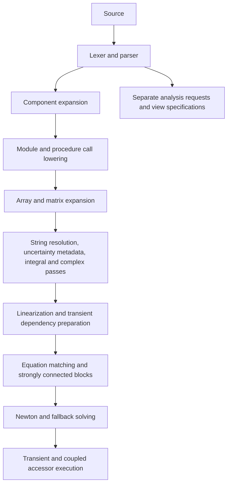

# A simpler, unified language for frees

Date: 11 September 2026

Status: **design proposal; target examples are not implemented syntax**

Investigated source: `61f523030742e965aeb3315c881efd2eafd151ad`, incorporating main through `ba2add6`.

Roadmap: [NEXT_STEPS.md, phase 4.7b-7](../NEXT_STEPS.md#phase-47b-7--unified-language-and-matlab-style-calls).

## 1. Recommendation

Use **one `function` declaration, one call form, and a small set of control-flow keywords**.
Represent tables, models, simulation runs, plots, guesses, and events through ordinary calls
with named options. Remove the separate `CALL`, `MODULE`, `PROCEDURE`, and `COMPONENT`
declaration/call grammars from the final language.

Do **not** ask users to select an equation or procedure mode. A function can contain
mathematical relations and ordered calculations. Their operators identify what each
statement means:

- `=` states an equation between numerical expressions, throughout the language.
- `:=` performs an ordered calculation, including updating a local accumulator.
- `==` compares values inside a condition; it does not add an equation.

This is an equation language with MATLAB-style declarations, calls, indexing, and loops.
It is deliberately **not a promise of MATLAB source compatibility**. In particular, copying
MATLAB's assignment meaning for every `=` would change the central behavior of an existing
frees model. Supporting a callable syntax also does not implement MATLAB toolboxes.

The proposal removes declaration modes without pretending that a constraint and a state
update are the same operation. Most mathematical functions need only equations; `:=`
appears only when the author actually writes an algorithm.

### What the user's example becomes

All examples in sections 1–12 show the **proposed final language**, unless labelled current.

```text
trace = [1, 3, 2, 6, 4, 9, 5, 12]

detrended = detrend(trace)
centered = detrend(trace, 'constant')
smoothed = smooth(trace, 3)
tapered = window(detrended(1:8), 'hann')

centered_mean = mean(centered)
residual_mean = mean(detrended)
left_edge = smoothed(1)

check(centered_mean, 0, tolerance=1e-9)
check(residual_mean, 0, tolerance=1e-9)
check(left_edge, 2, tolerance=1e-9)
check(tapered(1), 0, tolerance=1e-9)
check(tapered(8), 0, tolerance=1e-9)
```

There is no special list of functions permitted to use this form. Signal, matrix, control,
property, interpolation, and user-defined functions all use the same signature resolution.
A function can still reject unsupported input types; accepting parentheses does not imply
that every scalar function supports arrays.

## 2. What the implementation actually does today

The investigation traced the lexer, parser, definition AST, expression evaluator, procedure
and matrix expansion, component expansion, steady solver preparation, transient solver,
analysis drivers, WASM boundary, editor, and documentation runner.

Some source comments describe old implementation milestones. For example,
[engine.rs](../crates/frees-core/src/engine.rs) still mentions stubbed calls, and the opening
comment in [ode/dynamic.rs](../crates/frees-core/src/ode/dynamic.rs) describes IDA as refused.
The executable paths now flatten calls and invoke `solve_with_ida`. Findings below follow
those paths, rather than treating those comments as current limitations.

| Finding | Evidence and implication |
|---|---|
| Keywords are already case-insensitive. | [token.rs](../crates/frees-core/src/token.rs), `keyword_or_ident`. Writing `module` instead of `MODULE` changes appearance only. |
| Multiple outputs already exist. | [parser/toplevel.rs](../crates/frees-core/src/parser/toplevel.rs), `multi_assign` and `function_def`, already accept `[a,b] = f(x)` and `function [a,b] = f(x)`. Both use the existing procedure path. |
| The obvious scalar output header is missing. | `function y = f(x)` currently fails parsing. Old single-output functions return through an assignment to the function's name. |
| One ordinary expression call does not reach every callable. | A declared procedure works through bracket assignment, but `y = procedure_name(x)` reaches the scalar evaluator and can report an unknown function. |
| Equations have different meanings inside existing procedures. | [procedures.rs](../crates/frees-core/src/procedures.rs), `execute_one`: a simple variable on either side becomes an assignment; an equation with neither side a variable is silently ignored. |
| Modules participate in the caller's equation system. | Module expansion namespaces locals and adds input/output binding equations. Declared “inputs” can be unknowns solved from constraints on outputs. |
| Numeric procedures can also participate in an inverse solve. | An output becomes a synthetic residual involving the procedure's inputs. Newton can vary those inputs and rerun the procedure; the procedure need not invert itself. |
| Procedure outputs currently rerun the body separately. | `call_proc_output` invokes the whole body for each output and residual evaluation. Randomness and caller-scope reads make changing this observable. |
| User-function arguments are not general MATLAB values. | Current execution accepts `&[f64]` and scalar scopes. Array kernels use expansion elsewhere; array-valued user functions require actual value/shape work. |
| Function locals inherit the caller's numeric scope. | `call_function` and `call_procedure` clone the caller scope. A new lexical function contract needs an explicit migration for captured names. |
| Array indexing currently uses square brackets. | [parser/expr.rs](../crates/frees-core/src/parser/expr.rs): `a[2]` is indexing; `a(2)` is parsed as a function call. |
| Analyses are separate execution paths. | [analysis/parametric.rs](../crates/frees-core/src/analysis/parametric.rs), [crates/frees/src/analysis.rs](../crates/frees/src/analysis.rs). Declaring a parametric table does not make an ordinary steady solve execute its rows. |
| Some metadata looks like equations. | [analysis/uncertainty.rs](../crates/frees-core/src/analysis/uncertainty.rs) extracts `UncertaintyOf(x)=...`, `DistributionOf(x)=...`, and `Correlation(x,y)=...` before solving. |
| Editor vocabulary is not the grammar. | [EquationEditor.tsx](../web/src/EquationEditor.tsx) highlights `STEP` and `DUPLICATE`, which are absent from the lexer keyword map. It also extracts signatures from snippets, including `CALL` prefixes. |
| Some guide punctuation is not implemented. | [language_fundamentals.md](../web/src/docs/language_fundamentals.md) lists `%` as modulo, but [lexer.rs](../crates/frees-core/src/lexer.rs) explicitly tests it as an unexpected character. Use the implemented `mod(...)` callable. |
| Existing safety limits do not bound total work. | [eval.rs](../crates/frees-core/src/eval.rs), `eval_reduction`, allows up to 2^24 iterations for one reduction. Nested loops, expensive bodies, and repeated residual evaluations multiply that work. |

### Observations checked against a fresh native build

Ran `cargo build -p frees-cli`, then ten small documents through
`target/debug/frees-cli solve` with a 15-second timeout per document.

| Probe | Observed result |
|---|---|
| Lowercase module with `v=i*r`, bracket call, `r=10`, output constrained to 2 | Solves the caller's unknown voltage to 20. |
| `function [q,r]=divmod(a,b)`, bracket call with 17 and 5 | Returns 3 and 2. |
| `function y=twice(x)` | Parse error: expected opening parenthesis at the equals sign. |
| `procedure twice(x:y)`, called as `a=twice(3)` | Unknown-function solve error. |
| `2*x=99` inside a function that returns `x`, called with 3 | Returns 3; the contradictory equation is ignored. |
| Function reads caller variable `outside=4`, adds input 2 | Returns 6. |
| `a=[1,2,3]; y=a[2]` | Returns 2. |
| Same document with `y=a(2)` | Unknown-function solve error. |
| Top-level `x=1; x=x+1` | Rejected as overspecified. |
| Function-local `x=a; x=x+1`, called with 1 | Returns 2. |

These checks confirm current behavior, not acceptance of the proposed syntax. Section 13
contains reproducible examples. No solver implementation was changed for this report.

## 3. One function declaration, with precise mathematical meaning

### Reusable equation model

```text
function current = ohm(voltage, resistance)
    voltage = current * resistance
end

current = ohm(voltage, 10 [Ohm])
current = 2 [A]
```

The caller solves `voltage = 20 [V]`. The function's input/output names describe the
interface; they do not force a solve direction.

A call instantiates private equations in the caller's graph. A nested call such as
`power = voltage * ohm(voltage, resistance)` creates an internal result binding with source
location information. It must not secretly run an independent nonlinear solver and discard
the relation to the caller.

### Ordinary multiple outputs

```text
function [quotient, remainder] = divide_integer(a, b)
    quotient = trunc(a / b)
    remainder = a - quotient * b
end

[q, r] = divide_integer(17, 5)
[q, ~] = divide_integer(17, 5)
q = divide_integer(17, 5)
```

One requested output means the first output. Fewer outputs discard trailing slots. Too
many outputs is an error. A discarded output never weakens a model's equations: it remains
an internal value if those equations need it.

### An algorithm uses the same declaration

```text
function total = accumulate(value, count)
    total := 0
    for k = 1:count
        total := total + value
    end
end
```

Each evaluation starts with fresh locals. The loop performs ordered updates. When its
result occurs in an outer equation, the numeric kernel runs for the current candidate input
values. It contributes an output relation just as today's procedure output does.

`count` must be a finite integer; a numeric loop does not silently round it. A negative or
zero count produces an empty `1:count` range under the new range rules.

### Relations and calculations can coexist

```text
function result = adjusted_root(x, offset=0)
    root^2 = x
    guess(root, 1, lower=0)

    correction := abs(root)
    result = correction + offset
end
```

`root` is a private algebraic unknown. `correction` is a directed calculation from its
current candidate value. The compiler emits the root constraint and a numerical call node;
it does not select a mode for the whole function.

The implementation must establish these rules before accepting mixed bodies:

1. A local introduced by `:=` is an ordered local; other numerical locals are algebraic
   symbols. Do not change the classification based on whether a solve succeeds.
2. Reads within ordered code use the latest preceding assignment. A first assignment that
   reads its own uninitialized local is an error. Algebraic symbols and formal inputs may
   be read as kernel inputs.
3. Equations that mention an ordered local bind to the preceding version visible at that
   source location. Reading it before a definite assignment is an error. Later updates do
   not retroactively change an earlier equation.
4. Exporting an ordered output uses its final version on every reachable return path.
   Conditional paths must assign it consistently.
5. Directed calculations create immutable internal versions and pure output nodes, with
   loop state private to the kernel. Reuse the existing procedure executor for these
   regions; extend lowering instead of introducing another nonlinear solver.
6. An equation may constrain a computed value, allowing its inputs to be solved. It never
   overwrites an ordered local. For example, `total=10` after a loop constrains the loop's
   final value.
7. Conflicting units, undefined outputs, unsupported recursion, or an unbounded computation
   produce errors at the source operation.

This is real compiler work, not a parser alias. Start with equation-only and calculation-only
bodies through their existing lowering paths; enable mixed bodies only after the versioning
and dependency checks exist. Until then, reject a mixed body clearly and allow composition
through a helper declared with the same `function` syntax.

### Why not infer everything from plain equals signs?

```text
x = 1
x = x + 1
```

As equations these are inconsistent. As assignments they finish with 2. No dependency
analysis can discover which meaning the author intended.

“Try assignments, then solve if something is unknown” is also unstable: adding one input
value could change the meaning of the same function. “A loop means procedure mode” fails
because loops can generate arrays of physical equations.

The recommended distinction is therefore between **operations**, not between kinds of
mathematical model. Keeping `:=` is the smallest explicit distinction that preserves
equation-first frees behavior. Exact MATLAB assignment semantics would instead require
another explicit equation form or scope; that is a different language decision, not a
free consequence of removing keywords.

## 4. One call resolver, with honest capabilities

All calls use `name(arguments, option=value)`. A call can return a scalar, array, several
outputs, or a specifically supported nonnumeric value. Zero-output calls are statements.

Reuse the existing intrinsic and expansion registries. Add one resolver over them, then
remove duplicate signature data as it becomes generated. Do not first rewrite every
numeric implementation into a new framework.

Each signature needs the information used by actual dispatch:

| Contract | Required behavior |
|---|---|
| Inputs | Required and optional arguments, stable names, defaults, positional order, and permitted named options. |
| Values | Numeric, string, boolean, numeric array, named function reference, model/port reference, or analysis result, as applicable. |
| Outputs | Order, count, element type, units, and shape rule; dependent shapes such as an FFT's input length remain explicit metadata. |
| Evaluation | Strict numeric, lazy numeric, equation expansion, graph/metadata construction, analysis execution, or presentation. |
| Context | Whether a call is valid in a residual, model construction, an analysis job, or after results exist. |
| Cost and determinism | Work-budget participation and whether the call is repeatable for the same explicit inputs. |

A lazy reduction or conditional cannot eagerly evaluate all arguments. `guess(x,...)`
takes a variable reference, not the current guessed value. `connect(a,b)` takes ports.
`plot(...)` produces a presentation request, not a numerical unknown.
These are signature rules, not separate call spellings.

- Positional arguments precede named arguments.
- Unknown, repeated, and positionally duplicated named arguments are errors.
- Defaults fill omitted arguments; they do not append equations that compete with supplied
  arguments.
- Required arguments remain required. Do not invent physical defaults to shorten examples.
- User definitions are lexical and instance-private. Pass dependencies explicitly.
- Reject duplicate definitions and ambiguous callable/array bindings within one scope.
  Preserve existing case-insensitive resolution during this migration.
- Existing built-ins retain canonical registry names. Lowercase presentation is a style
  choice, not a mass rename of every API.
- Resolve fixed shape and arity errors before Newton. Value-dependent domain errors can
  still arise during evaluation; diagnostics must distinguish them.

A named reference `@name` is proposed for passing an existing function to a driver. Initially
support named references only; closures, anonymous functions, classes, and arbitrary dynamic
dispatch are unnecessary to remove the old tags.

Preserve bounded numeric recursion, including lazy base-case branches. Recursively expanding
an equation or component graph requires a construction-time termination proof or a finite
expansion limit; reject unsupported recursive graphs instead of overflowing the stack.

For new pure functions, all requested outputs must come from the same logical evaluation.
Reuse that result within the current residual evaluation; never cache it across changed
inputs or solver states. Random sampling belongs to an explicit seeded run/input binding.
Do not silently change legacy functions' repeated-output or caller-scope behavior.

## 5. Complete keyword migration map

This inventory comes from the lexer keyword map, its composite `STATE TABLE` token, and the
editor's additional highlighted words. Names in the right column that look like functions
are ordinary registered calls, **not replacement reserved keywords**.

| Current form | Proposed canonical form | Meaning retained |
|---|---|---|
| `CALL f(in : out)` | `out = f(in)`; `[a,b] = f(in)` | Output order, shapes, private temporaries, source diagnostics. |
| `FUNCTION f(x)` | `function y = f(x)` | Explicit return name; legacy assignments migrate according to their actual behavior. |
| `FUNCTION [a,b] = f(x)` | Same header in lowercase | Existing multi-output surface, generalized body contract. |
| `PROCEDURE f(in : out)` | `function out = f(in)` | Ordered operations become explicit `:=`; no separate procedure declaration. |
| `MODULE f(in : out)` | `function out = f(in)` | Equations are instantiated in the caller, including inverse solving. |
| `COMPONENT Name(ports)` | `function [ports,...] = name(parameters)` with `port(...)` calls | Typed ports, local equations, hierarchy and storage. |
| `PARAM x` / `PARAM x=default` | Required/defaulted function arguments | Required physical inputs stay required. |
| `VARIANT name` | A construction-time `if` on an explicit parameter | Select structure before equation matching. |
| `REQUIRE a,b` | Required arguments; `require(a,b)` for a selected optional branch | A missing selected parameter is diagnosed before solving. |
| `CONNECT ...` / `connect ...` | `connect(port1, port2, ...)` | Across-variable equality, flow conservation, stream/domain rules. |
| `TABLE name ... END` | `curve = lookup_table(...)`, then `curve(x)` | Interpolation, curve families, units, log-axis options. |
| `PARAMETRIC ... END` | `runs = sweep(model, 'input', values, ...)` | Row/grid semantics, pinned inputs, collected outputs. |
| `PLOT ... END` | `plot(x, y, title='...', ...)` | Plot specification and rendering after results exist. |
| `STATE TABLE ... END` | `state_table(..., fluid='...')` | Thermodynamic state presentation and property metadata. |
| `DYNAMIC ... END` | A function containing `der(...)`, then `simulate(model,...)` | State equations, algebraic coupling, initials and integration settings. |
| `EVENT name: ... -> ...` | `event(surface, name='...', direction='...', action='...')` | Root crossing, direction, stop/record/reset behavior. |
| `LINEARIZE ... END` | `[A,B,C,D] = linearize(model,...)` | Explicit operating point and ordered state/input/output references. |
| `INPUT` / `OUTPUT` inside linearization | `inputs=[...], outputs=[...]` options | Selected perturbations and observations; not a new declaration type. |
| `GUESS x=...` | `guess(x, value, lower=..., upper=...)` | Solver seed and bounds, never a hard equation pin. |
| `SYMBOLIC s` | `s = symbol('s')` | A symbolic indeterminate distinct from a numerical unknown. |
| `FOR i=a TO b` | `for i = a:b`; `for i = a:step:b` | Equation generation or bounded ordered iteration, with defined range direction. |
| `IF condition THEN` | `if condition` | Construction-time branch or numeric ordered branch, as specified below. |
| `ELSE` | `else` | Alternative branch. |
| `WHILE condition DO` | `while condition` | Bounded numeric iteration. |
| `REPEAT ... UNTIL c` | `while true ... if c; break; end; end` | Test after the body; no separate repeat/until grammar. |
| `END` | `end` | A single block terminator. |
| `AND`, `OR`, `NOT` | `&&`, `\|\|`, `~` | Defined boolean and short-circuit behavior. |
| Editor-only `STEP`, `DUPLICATE` | Remove unsupported suggestions; use `for` with a range | Do not imply syntax the parser does not accept. |
| `{ CHECK ... }` example markers | `check(actual, expected, tolerance=...)` | A post-solve assertion, excluded from equation counts. |

The small canonical statement vocabulary is `function`, `end`, `if`, `else`, `for`,
`while`, and `break`, plus boolean literals. Domain operations stop growing the keyword
list. This does not make words like `simulate` or `connect` semantically interchangeable:
their signatures and result types define their capabilities.

### Control-flow rules

- Remove `THEN`, `DO`, and `TO`; the line break and range delimit the header.
- Ranges use `start:stop` or `start:step:stop`, inclusive when reached. Default step is +1.
  `3:1` is empty; write `3:-1:1` to descend. Reject zero/nonfinite steps and fractional
  array indices. This differs from current loops' implicit reversal and rounding.
- Equation-generating `for` bounds must be known at graph construction. Bounds changing
  with a Newton iterate cannot change the equation count.
- A structural `if` may select different equations/components only from values known
  before graph construction. An ordered `if` can depend on a current numeric input and
  must preserve definite assignment.
- For value-dependent piecewise physics, use a lazy numerical expression such as
  `y = select(x >= 0, positive(x), negative(x))`. The branches must have compatible
  result type/shape. This does not promise smoothness or convergence at the boundary.
- `while` is for ordered calculations. It cannot add a changing number of equations,
  create ports, start analyses, or perform plotting on each residual evaluation.
- `break` exits the nearest ordered loop. A migrated repeat loop evaluates its old
  termination condition after executing the body.

## 6. Arrays, literals, strings, units, and names

A unified proposal must resolve punctuation conflicts, not just replace block headers.

| Area | Decision |
|---|---|
| Array construction | Keep `[1,2,3]` and semicolon-separated matrix rows. A bracketed left side before a call destructures outputs. |
| Array access | Canonical `a(i)`, `a(i,j)`, and `a(1:n)`, one-based. Legacy `a[i]` is migration syntax. |
| Calls versus indexing | Resolve the symbol's binding/type before dispatch. An array binding means indexing; a callable binding means invocation. An unresolved ambiguous binding is a diagnostic, not a trial evaluation. |
| Initial conditions | Replace call-shaped `x(0)=x0` with `initial(x,x0)`; zero remains an invalid array index. The simulation start time defines the initial instant. |
| Array size | Infer from declared inputs/literals/shape rules independently of textual equation order. Solver-dependent dimensions are unsupported until a dedicated bounded path exists. |
| Output destinations | Support named arrays first; then explicit slices with shape checks. Keep `~` for discarded outputs. Never silently resize an unrelated array. |
| Matrix operators | Retain matrix multiplication/division, elementwise dotted operators, powers and transpose with documented shape rules. Do not add automatic broadcasting to every scalar intrinsic. |
| Comparisons | `==`, `~=`, `<`, `<=`, `>`, `>=`; `=` remains an equation. |
| Strings | Canonical single-quoted strings. Remove the need for a trailing `$` on a string variable; infer/check its type from binding. |
| Comments | Canonical `// comment`. Migrate brace comments and double-quoted legacy comments without interpreting them as executable code. |
| Percent | Keep `%` unsupported in the canonical grammar; use `mod(a,b)` for remainder and `//` for comments. Correct the guide's unsupported modulo claim. Recognize other imported dialects only through an explicit converter. |
| Constants | Expose an immutable `const` namespace from the existing registry, e.g. `const.pi`, `const.g`, `const.r`. Migrate suffixed constants such as `pi#` by registry identity, not a general text replacement. |
| Units | Keep readable numerical annotations such as `10 [Ohm]` and declared argument/output units. Preserve SI conversion and original display units. |
| Temperature | Preserve the distinction between absolute Celsius/Kelvin and temperature differences; conversion is not always multiplication by a factor. |
| Complex arithmetic | Preserve existing imaginary literals and complex expansion with an explicit solve setting. Do not repurpose a normal loop variable `i` as an imaginary constant or assume every real-only property routine accepts complex inputs. |
| Identifiers | Keep existing case-insensitivity for this migration; preserve source spelling in display and diagnostics. `T` and `t` still refer to the same symbol, so recommend `temperature` and `time`. |
| Member access | A port/model/result field is a typed reference. Existing flattened dotted variable names are not already a general record/object implementation. |
| Separators | Newlines or semicolons separate statements. Retain explicit `end`; do not introduce indentation-sensitive parsing. |

For nonnumeric immutable values, `name = constructor(...)` binds a name to the constructed
value. It contributes no scalar equation. This rule applies to a table handle, symbol,
model reference, or analysis result; redefinition in the same scope is an error. Numerical
arrays remain mathematical values and contribute element equations.

No generic object system is needed. Add the specific value variants required by tables,
named references, models, ports, and results, along with their type checks.

Preserve solver-setting precedence: source `guess(...)` fields win over corresponding GUI
guess/bound fields, with GUI values filling omissions. A guess never pins a variable.
Keep numerical method, tolerances and resource settings in the solve/run options, rather
than adding another family of language directives.

## 7. Components are functions with typed ports

An acausal component is a reusable set of equations with connection contracts. It can use
the same function declaration without losing those contracts.

```text
function [p, n] = resistor(resistance)
    p = port('electrical')
    n = port('electrical')

    p.v - n.v = resistance * p.i
    p.i + n.i = 0
end

function [p, n] = voltage_source(voltage)
    p = port('electrical')
    n = port('electrical')

    p.v - n.v = voltage
    p.i + n.i = 0
end

function current = circuit(source_voltage, resistance)
    [p, n] = resistor(resistance)
    [supply_p, supply_n] = voltage_source(source_voltage)
    connect(supply_p, p)
    connect(supply_n, n)
    ground(n)
    current = p.i
end

current = circuit(12 [V], 10 [Ohm])
```

Here `port` constructs a typed connection endpoint; it does not create a numeric return
value. `ground` is an ordinary library graph operation that contributes the reference
condition. A numerical equation using a port object directly is a type error.

For separate components, `connect(a,b,c)` merges a connection set. It must retain the
existing domain implementation:

- across quantities agree;
- signed flows sum to zero;
- fluid/thermal stream mixing and transport rules remain domain-specific;
- incompatible domains, impossible connections and unconnected required ports are reported;
- each function instance has independent locals and storage states;
- hierarchical functions compose their contained graphs;
- externally observable members retain stable names through generated aliases or explicit
  outputs, so plots and saved projects do not lose their references.

Returning a port does not turn the physical model into a one-way calculation.

### Parameters and variants

Required/defaulted arguments replace ordinary `PARAM` declarations. Use construction-time
branches for variants, selected by an explicit string or boolean argument.

For legacy variants with conditionally required parameters, use an optional argument whose
default is the explicit sentinel `missing()`, plus `require(argument)` inside the selected
branch. The sentinel is distinct from an algebraic unknown and from zero. It must never
reach numerical evaluation.

Prefer separate small functions when variants have unrelated signatures. Do not create
a separate variant registration framework merely to preserve a keyword.

A variant that changes the graph must be fixed before structural checking. Switching it
during a transient requires event/state modeling with a fixed supported structure, or a
separate run; it is not ordinary numeric `if` inference.

## 8. Models, steady solves, transients, and events

### Separate model definition from the requested experiment

`model(@function, arguments...)` binds a function and its arguments into a reusable model
description. It does not solve or add its equations to the document merely by being named.
The constructor resolves trailing arguments against the referenced function's signature.

An ordinary direct function call instantiates its equations in the current model. A model
handle is instantiated by an explicit driver such as `solve`, `simulate`, or `sweep`.
Each run gets independent numerical state.

Unbound numerical parameters may remain free in a model description for a sweep or inverse
solve. Missing structural parameters, such as a variant selector or array dimension, cannot
remain free. A driver must produce a structurally determined problem before Newton runs.

```text
plant = model(@circuit, source_voltage=12 [V], resistance=10 [Ohm])
dc = solve(plant)
plot([0, 1], [0, dc.current], title='Current')
```

Top-level numerical equations remain an implicit document model, so existing short equation
sheets need no explicit `model` or `solve` wrapper. The UI's Solve action evaluates that
model and any declared analysis jobs according to their dependencies.

### Differential models use the same declaration

```text
function [position, velocity] = oscillator(mass, damping, stiffness)
    der(position) = velocity
    mass * der(velocity) + damping * velocity + stiffness * position = 0 [N]

    initial(position, 1 [m])
    initial(velocity, 0 [m/s])
    event(position, name='zero_crossing', direction='falling', action='record')
end

plant = model(@oscillator,
              mass=1 [kg], damping=0.2 [N*s/m], stiffness=10 [N/m])

run = simulate(plant, time=[0, 5] [s], points=501, method='ode45')
plot(run.time, run.position, title='Displacement')
```

The example's unit annotation on an array applies to each element; supporting that
postfix form is part of the proposed value grammar, not an existing capability assumed
by this report.

`der` identifies a differential state; `initial` declares its initial condition. The driver
chooses the analysis. A plain steady solve of a model containing derivatives must require
an explicit steady policy, e.g. `solve(plant, steady=true)`, which sets derivatives to zero.
It must not silently ignore time dependence or treat an initial value as a steady boundary.

For explicit time-dependent forcing, `time()` reads the owning simulation's independent
variable through a declared context capability. It does not capture an arbitrary caller
variable. A steady analysis of time-dependent forcing must supply an explicit evaluation
time. Legacy initial-condition timestamps must match the selected start time or produce a
migration diagnostic; do not silently move an initial condition to another instant.

Reuse the current explicit/stiff integration and IDA/DAE paths. Preserve consistent
initialization, state/algebraic partitioning, tolerances, sample grids, progress, cancellation,
and diagnostics. Detect missing/conflicting initials at model preparation.

### Events

`event(surface,...)` registers a zero crossing in the owning model. Options cover direction,
name, stop/record/reset action and tolerances.

A reset uses explicit reference/value options, for example:

```text
event(position, direction='falling', action='set',
      target=velocity, value=-restitution * velocity, name='bounce')
```

The reset value is evaluated against the pre-event state. Apply the reset and recompute
consistent algebraics/derivatives before continuing. Define simultaneous-event ordering and
retrigger suppression from the existing event behavior; reject unsupported combinations.
Do not replace event detection with a sampled `if position < 0` loop.

### Result access and solver feedback

Use explicit result values: `run.position`, `final(run.position)`, `max(run.position)`,
and `time_at(run.position, target)`. They replace global “active ODE table” accessors.

A result column carries its owning run and sample/time metadata. Operations needing time,
such as `time_at` and integration, require that metadata or an explicit time vector.

Current ODE accessor equations can feed a trajectory result back into an outer solve.
Preserve that capability through an explicit nested analysis dependency with a budget and
source path. A recursive job dependency must be detected. Do not schedule a coupled
trajectory metric once after Newton and claim equivalent results.

## 9. Tables, sweeps, plots, and thermodynamic state views

### Lookup data becomes a callable value

```text
curve = lookup_table([0, 1, 2], [50, 40, 0], method='linear')
pressure = curve(flow)
```

Preserve x/y units, axis log flags, sorted/duplicate-data policy, extrapolation behavior,
and curve-family interpolation. Carry the existing named-table precedence for imported
legacy projects; canonical documents diagnose duplicate local bindings.

A lookup table, sweep result, and thermodynamic state view are different values. Reusing
the word “table” must not make their execution semantics interchangeable.

### Sweeps become explicit jobs

```text
plant = model(@circuit, resistance=10 [Ohm])
runs = sweep(plant, 'source_voltage', [0, 6, 12] [V])
plot(runs.source_voltage, runs.current, title='Current versus voltage')
```

For several axes, accept repeated name/value pairs and an explicit `combine='grid'` or
`combine='zip'` option. Validate lengths for zip, and estimate total runs before execution.

Swept values bind the model's formal input slots for each run. They replace a default or
previous argument binding, with one effective binding per slot. They do **not** append a
second equation to a hard-coded internal constraint.

This distinction matters today: `row_source` appends pinning equations to source text.
Sweeping a variable already fixed by an equation can overspecify the problem. Migration
must identify an actual input binding, or report that the model needs refactoring.

Keep column units, individual row failures, continuation/warm starts, and stable row order.
Run-wide aggregates use the explicit `runs` value. Legacy whole-table feedback requires
the existing fixed-point behavior and convergence diagnostics, rather than an accidental
self-referential result graph.

### Plots and state tables become presentation calls

`plot` options should map onto the current plot specification: kind, labels, units, axes,
series selection and supported styling. Validate option names before execution. Plotting
is performed after its inputs are ready and once per requested result, outside Newton.

`state_table(...)` accepts selected state variables/columns plus fluid and presentation
metadata. During migration, translate current numbered state names and indexed arrays.
Do not make a view duplicate physical property equations already in the model.

Use result-bound columns as the canonical form. Keep string-based legacy references only
in the compatibility adapter; new references should resolve to a particular model or run.

## 10. Linearization, fitting, uncertainty, optimization, and symbolic work

Unifying syntax should also expose analysis capabilities that presently require separate
request JSON or a dialog. These are ordinary calls with analysis signatures, not scalar
functions inserted into the residual evaluator.

| Capability | Proposed surface | Contract to preserve |
|---|---|---|
| Linearization | `[A,B,C,D] = linearize(plant, inputs=[...], outputs=[...], at=...)` | An explicit equilibrium/trajectory point; ordered states, units, algebraic elimination and existing numerical method. |
| Local sensitivity | `report = sensitivity(plant, inputs=[...], outputs=[...])` | Scale conventions, perturbation settings and per-output diagnostics. |
| Parameter fitting | `fit = parameter_fit(plant, data, parameters=[...], ...)` | Bounds, weights, loss, covariance, standard errors, rank and failure diagnostics. |
| Curve fitting | `fit = curve_fit(data, ...)` | Model family, coefficients, residuals and current supported algorithms. |
| Monte Carlo | `samples = monte_carlo(plant, samples=1000, seed=7, ...)` | Distribution/correlation inputs, design, quantiles, repeatability and work estimate. |
| Optimization | `optimum = optimize(plant, objective=..., parameters=[...], ...)` | Constraints, bounds, stopping rules and failure reporting; multi-objective results retain Pareto structure. |
| PID tuning / plant extraction | `controller = pid_tune(...)`; `plant = extract_plant(...)` | Existing analysis inputs/results; no hidden dependency on finding a `DYNAMIC` tag in source text. |
| Uncertainty metadata | `uncertainty(x, sigma=...)`, `distribution(x,...)`, `correlate(x,y,rho)` | Metadata excluded from equation counts; positive-semidefinite correlation validation and units. |
| Numerical uncertainty query | `uncertainty_of(result.x)` | Propagated uncertainty attached to a particular solution. |
| Symbolic identity | `s = symbol('s')` followed by supported polynomial relations | A symbolic indeterminate, not a Newton unknown; preserve current supported identity limits. |
| CAS operations | Existing operations through `simplify(...)`, `differentiate(...)`, etc. where available | Keep the distinction between symbolic objects and evaluated numbers; no claim of arbitrary symbolic equation solving. |

The table specifies operation families, not a finished set of argument schemas. Each
implementation PR must freeze its schema from the existing Rust request/result types and
add it to the shared manifest before exposing it in the editor.

Required references in `inputs`, `outputs`, objectives and operating points resolve against
the model's exported interface. Missing references and dimensional mismatches are errors;
the implementation must not guess a model by whichever table was last active.

For symbolic polynomials, reuse the existing coefficient/identity machinery. Do not build
a new CAS to remove `SYMBOLIC`. Report unsupported multiple indeterminates and nonpolynomial
identities explicitly until their existing solver support expands.

## 11. Solver architecture: share the surface, retain the proven engines

### Current route



The precise steady preparation is in
[engine/prepared.rs](../crates/frees-core/src/engine/prepared.rs).
Transient/analysis feedback can revisit numerical solving; the diagram is a dependency
overview, not a claim that every document executes each box once.

### Target route

1. **Parse without choosing a solver mode.** Preserve spans, comments, calls, assignments,
   equations, member/index access, and lexical blocks.
2. **Resolve bindings and signatures.** Determine callable versus array, named arguments,
   defaults, units, output slots, shapes, graph references and analysis capabilities.
3. **Lower using existing mechanisms.** Equation functions become namespaced relations;
   ordered regions become numerical output nodes; components become typed connection
   equations; array operations become existing scalar/kernel forms.
4. **Prepare the mathematical system.** Reuse matching, blocking, Newton, unit checks,
   uncertainty extraction, complex/integral handling, ODE/DAE and linearization code.
5. **Schedule explicit analysis dependencies.** Steady results, sweeps, transients and
   advanced analysis jobs have named inputs and results. Detect cycles; retain deliberately
   supported outer-solve and fixed-point feedback.
6. **Render or check completed results.** Plot and state views, assertions, tables and
   exports consume results without becoming residual evaluations.

Do not start by replacing the scalar solver with a universal dynamic object interpreter.
Model handles and ports are primarily construction-time values; plot handles are
presentation values. Most existing residual evaluation can stay numerical.

### Structural and numerical validation remain different

Check must distinguish a reusable model with unbound inputs from a runnable experiment.
A valid function definition is not an underspecified worksheet. A requested solve with
remaining degrees of freedom is.

Run the same resolved/lowered representation through Check and Solve so they agree on
equation counts, hidden outputs, connections and metadata. Structural validity still does
not guarantee numerical convergence.

Error messages should identify the user's function/call/array element and instance path.
Avoid presenting `proc$...` or generated matrix temporary names as the only explanation.

### Resource limits are part of the language contract

The reported fuzz input was:

```text
3./sum(i,11111111 ,-85,i^11111113^31-1^11193)
```

Its descending reduction has 11,111,197 iterations, below the current 16,777,216 limit.
The guard therefore does not reject it on span alone. The timeout report is evidence of a
real work-budget gap, not proof that raising a CI timeout is the right fix.

This investigation inspected the guard; it did **not** rerun the sanitizer artifact or fix
that failure. Do not mark the regression fixed because a later randomized smoke run passes.

Use a shared, decrementing evaluation/expansion budget across reductions, nested user calls,
ordered loops, array generation, numerical probing and nested analysis work. Retain sensible
local ceilings as early validation; make the total budget cumulative. Check requested array
sizes and sweep sizes before allocation.

Native and WASM execution need a consistent exhaustion error. Worker cancellation must
remain responsive; a posted message cannot interrupt an indefinitely running synchronous
WASM call by itself. Preserve existing worker termination/restart behavior where needed.

Do not sacrifice domain-error backtracking: ordinary invalid Newton trial points should
still be distinguishable from an exhausted budget or an invalid program.

## 12. Migration and delivery plan

### Versioned meaning, not silent reinterpretation

Use a language-version field in saved projects and CLI/WASM request metadata. Old documents
without a version remain legacy documents. New documents select the new version through
their containing project/request; no capitalized directive is added to every file.

Plain text export must carry a machine-readable version in a comment, for example
`// frees-language: 2`. The importer reads it before lexing. A conflict between an explicit
request version and text version is an error. Copying an unmarked fragment does not silently
opt an existing legacy project into new semantics.

This is needed even when a document contains no `CALL`: legacy procedural `=`, descending
loops, caller-scope lookup, string comments and initial conditions have meaning changes.

The converter must parse the legacy document. Do not use repository-wide regex replacement
as the migration engine.

- Convert `CALL` and output slots using resolved signatures.
- Convert module definitions to equation functions.
- Convert actual procedural assignments, including variable-sided `=`, to `:=`.
- Flag ignored non-variable procedural equations for author review. Promoting them to active
  constraints or silently deleting them can change results.
- Add explicit parameters for caller-scope dependencies, with a review when the binding is
  ambiguous.
- Convert initial conditions before array call/index resolution.
- Rewrite descending loops with an explicit negative step, preserving old integer rounding
  where needed; do not silently adopt new range semantics for old bounds.
- Preserve comments, display spelling, units, output order, instance names and project
  references.
- Freeze legacy random/call behavior in compatibility tests; any new pure behavior is
  versioned.
- Surface each unresolved conversion with an actionable location and keep the original file.

### Implementation-sized PRs

Each stage is a reviewable PR (or a short sequence if a subsystem warrants it), followed by
its required checks and merge. The rows are **planned**, not completed.

| Stage | Change | Exit evidence |
|---|---|---|
| U0 — contract and inventory | Freeze the operator, scope, value and migration rules in this proposal; enumerate callable signatures and legacy grammar fixtures. | Inventory includes every lexer keyword, registered dispatch path and frontend-only operation; current-behavior probes recorded. |
| U1 — complete call syntax | Reuse bracket assignments; add scalar output headers, single-result expression lowering, output sinks and one resolver. | Built-in, module, procedure and user-function calls agree on order, arity, shapes and errors in native/WASM. |
| U2 — one function declaration | Lower equation functions through modules and ordered functions through procedures; add lexical binding and migration diagnostics. | Forward/inverse module examples and legacy algorithm equivalents match; ignored equations cannot pass unnoticed. |
| U3 — mixed operations and control flow | Add definite assignment/versioning, mixed-body lowering, colon loops and simplified conditionals. | Reordering equations preserves meaning; ordered updates retain order; invalid graph-changing numeric control flow is rejected. |
| U4 — value syntax | Add callable/array resolution, parenthesized indexing, named arguments, supported nonnumeric values and initial-call syntax. | No call/index/initial ambiguity; type, shape, unit and duplicate-binding diagnostics checked. |
| U5 — physical model composition | Migrate component declaration, parameters, ports, connections, hierarchy and variants. | Domain conservation, steady/storage behavior, independent instances and saved member references match existing fixtures. |
| U6 — analysis and presentation | Add model/run references and ordinary calls for lookup tables, sweeps, simulation, events, linearization, plots and state tables. | Same results/settings as existing drivers; explicit run ownership, feedback behavior and row/input binding tested. |
| U7 — remaining analysis parity | Connect sensitivity, fitting, uncertainty, Monte Carlo, optimization, control analysis and symbolic operations through shared schemas. | CLI, WASM worker, browser dialogs, editor and exports express the same supported inputs/results. |
| U8 — product migration | Convert library data, fixtures, examples, snippets, help, saved-project handling and reference generators. | Every runnable example executes through the appropriate driver; converted documents retain values and diagnostic meaning. |
| U9 — removal | End the documented compatibility window, move legacy import behind conversion, remove legacy grammar and obsolete keyword suggestions from normal execution. | New-format production grammar has no `CALL`, `MODULE`, `PROCEDURE`, `COMPONENT` or old domain block forms; remaining legacy text is explicitly import/migration evidence. |

Ordering dependencies matter: U0 freezes signatures; U1 provides the positional call bridge;
U4 completes named arguments/value dispatch needed by U5–U7. Work-budget plumbing should be
introduced in the first affected shared evaluator/expander stage, not postponed until U9.

U2 must not silently accept mixed semantics before U3. Until U3 lands, explain the limitation
and allow separate helper functions through the same declaration/call surface.

### Frontend and documentation work is part of implementation

Update [EquationEditor.tsx](../web/src/EquationEditor.tsx),
[editorCompletion.ts](../web/src/editorCompletion.ts),
[signatureHelp.ts](../web/src/signatureHelp.ts), function/component catalogs,
[api.ts](../web/src/api.ts) and
[engine.worker.ts](../web/src/wasm/engine.worker.ts) alongside the corresponding stage.

Replace source-regex assumptions in features such as
[pidLoop.ts](../web/src/pidLoop.ts), which currently looks for a `DYNAMIC` header.
Generate usage/help signatures from resolved metadata rather than discovering callees by
stripping `CALL` from snippets. Update the Tools/Functions menus, default document, quick
help, errors, reference manifest and project serialization.

The [REPL](../web/src/ReplTerminal.tsx) currently has session assignments and commands separate
from document solving. Migrate ordered session updates to explicit `:=`; an equation entered
in the new-language REPL must be added to a clearly identified session model or rejected with
guidance to the editor. It must not silently become an assignment. Keep console commands
such as `clear` and `help` as console actions, outside the equation grammar.

Update [formatted-equation rendering](../crates/frees-core/src/parser/latex.rs) for the new AST
forms and source aliases. This is an AST-to-LaTeX display path, not another input language;
displaying a calculation must not make it look like an independent physical constraint.

The existing [documentation runner](../web/scripts/check-doc-examples.mjs) executes selected
Markdown fences under `web/src/docs` and recognized analysis JSON blocks. It does not
automatically execute every gallery string or every proposal example. Extend coverage
deliberately as canonical examples move; distinguish illustrative fragments from complete
runnable documents and assert expected values.

### Acceptance matrix

| Case | Required assertion |
|---|---|
| Equation function solved forward and backward | Same equations/results within existing tolerances; no local solve that severs dependencies. |
| Nested single-output call and multi-output matrix/signal call | Correct output order, shapes, units and private names. |
| Discarded or omitted outputs | Internal constraints retained; unrelated names untouched. |
| Ordered accumulator and mixed root/correction example | Correct updates and dependency order; no read-before-assignment. |
| Equation-only statement in an algorithm migration | Preserved deliberately or flagged; never silently ignored. |
| Module or component instantiated twice | Independent locals, states and output references. |
| Lookup table called like a function | Same interpolation, units, family and boundary policy. |
| Array access versus function call versus initial condition | Deterministic resolution, including invalid index zero. |
| Sweep of a defaulted formal input | Exactly one effective input value per row; hard-coded constraints are not silently overwritten. |
| ODE, stiff ODE, DAE, event reset and coupled accessor solve | Existing result/event tolerances, consistent initialization and feedback. |
| Structural variant with unknown selector | Clear preparation error, not a changing Newton graph. |
| Linearization / fitting / sampling | Existing diagnostics/settings reach native, WASM and browser interfaces. |
| Metadata, plot and check calls | Excluded from equation counts; executed in the right phase. |
| Seeded multi-output calculation | Consistent outputs for one evaluation; explicit legacy behavior where applicable. |
| Fuzz timeout input and nested variants | Bounded completion with a result or budget error, not a process timeout. |
| Legacy import and new text export | Version preserved, conversion review available, round-trip behavior checked. |

Use existing parser/evaluator, solver, parity, native, WASM, fuzz and documentation suites.
Add behavior tests at these boundaries; do not add tests that merely repeat every parser
implementation branch. Merge a stage only after its required checks pass.

## 13. Reproducing the key current-language findings

These are **current syntax**, not the proposed language.

Build once:

```sh
cargo build -p frees-cli
```

Module input solved from its output:

```sh
target/debug/frees-cli solve <<'MODEL'
module ohm(v,r:i)
  v=i*r
end
[current]=ohm(voltage,10)
current=2
MODEL
```

Expected: `current=2`, `voltage=20` (plus internal module variables).

Existing multi-output function syntax:

```sh
target/debug/frees-cli solve <<'MODEL'
function [q,r]=divmod(a,b)
  q:=trunc(a/b)
  r:=mod(a,b)
end
[q,r]=divmod(17,5)
MODEL
```

Expected: `q=3`, `r=2`.

Silently ignored procedural equation:

```sh
target/debug/frees-cli solve <<'MODEL'
function f(x)
  2*x=99
  f:=x
end
a=f(3)
MODEL
```

Observed today: `a=3` with no enforcement of `2*x=99`. The new-language migration must
not hide this discrepancy.

## 14. Decision to carry into implementation

Adopt the small shared syntax and preserve frees' equation-first identity:

- **One declaration:** `function`.
- **One invocation:** `f(...)`, with scalar or bracketed outputs.
- **No function mode:** equation relations and ordered calculations are explicit operations.
- **Ordinary calls for domain tasks:** connection, simulation, analysis and presentation
  retain their capabilities without separate block grammars.
- **Existing solvers underneath:** unify parsing, binding and user experience; reuse the
  mathematical engines.
- **An explicit migration endpoint:** remove `CALL` and the other legacy forms from normal
  execution after conversion and parity are demonstrated.

The main tradeoff is deliberate: retain `:=` for mutable algorithms instead of promising
that ambiguous equals signs can always be inferred. That keeps the common mathematical
case short while making the exceptional ordered case unambiguous.
